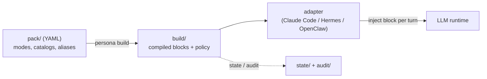

# persona-engine

[English](README.md) | **日本語** | [简体中文](README.zh-CN.md) | [ไทย](README.th.md)

> 本ドキュメントの正本は英語版（README.md）です。翻訳は英語版に追随するため、内容が一部遅れる場合があります。


persona-engine は、LLM エージェントの人格モードを安全に切り替えるための、ポリシー駆動のエンジンです。各モードを YAML で記述し、`persona build` で一度コンパイルすれば、ランタイムアダプタが毎ターン適切なコンパイル済みブロックを注入します。どのモードをどこで使えるか — そして誰が切り替えられるか — は明示的なルートポリシーが決定し、すべての遷移は追記専用の監査ログに記録されます。

## なぜ persona-engine か

1 つのアシスタントを複数のサーフェスで運用する場面を考えてみてください。プライベートな作業セッション、公開チャンネル、グループチャット。作業中は集中して簡潔に、雑談ではリラックスして、公開の場では厳密に中立でいてほしい。素朴なやり方 — アプリケーションコード内で system prompt の文字列を差し替える — は、うまくいっているうちは問題ありませんが:

- コンテキストの確認を忘れたコードパスから、プライベートセッション用の「カジュアル」プロンプトが公開チャンネルに漏れる。
- 「先週火曜のあの会話で、どのペルソナが有効だったか」に誰も答えられない。何も記録されていないからです。
- プロンプトは際限なく肥大化し、誰かが文字列をその場で書き換えるたびに、ペルソナはセッション中に静かにドリフトしていく。

persona-engine は、ペルソナ管理を「散らばった文字列」から「コンパイル済み・ポリシー検査済みの成果物」に変えます:

| | 手書きのプロンプト切替 | persona-engine |
| --- | --- | --- |
| ペルソナ本文の置き場所 | アプリコード中に散在する文字列 | バージョン管理された YAML pack を一度コンパイル |
| 切り替えられる主体 | プロンプトを書き換えられる任意のコードパス | ルートポリシー: サーフェスごとの許可リストと切替レベル |
| 未知・未マッチのコンテキスト | たまたま有効だったものがそのまま | fail-closed: 空の `public` モード・切替不可 |
| プロンプトサイズ | 無制限・静かに肥大化 | モードごとのトークン予算 — 超過は切り捨てではなくビルドエラー |
| 追跡可能性 | なし | すべての遷移とポリシー判断を追記専用の監査ログに記録 |
| 安定性 | いつでも書き換わりうる | モードが有効な間、コンパイル済みブロックはバイト単位で不変 |

エンジンは LLM を呼び出さず、ペルソナ本文を解釈することもありません。扱うのは構造・参照・予算・順序・ポリシーであり、内容はあなたのものとして不透明なまま保たれます。

## 仕組み



アダプタは、信頼できるランタイムメタデータ（プラットフォーム・セッションキー）からルートコンテキストを導出し、コアにそのコンテキスト用のブロック解決を依頼し、返ってきたブロックをランタイムのリクエストスコープの拡張ポイントに注入します。ランタイムパスが読むのはコンパイル済み成果物だけで、YAML を読むことはありません。

| コンポーネント | 役割 |
| --- | --- |
| [packages/core](packages/core/) | TypeScript エンジン: pack コンパイラ・ルートポリシー・状態ストア・turn/set 契約・`persona` CLI |
| [adapters/claude-code](adapters/claude-code/) | Claude Code セッションに有効なブロックを注入する Python フック |
| [adapters/hermes](adapters/hermes/) | Hermes 系エージェントランタイム用アダプタ |
| [adapters/openclaw](adapters/openclaw/) | OpenClaw 系エージェントランタイム用アダプタ |
| [templates/pack-starter](templates/pack-starter/) | コピーして編集できる完全な 4 モードのサンプル pack |
| [SPEC.md](SPEC.md) | すべての実装が従う、凍結済みのフォーマット・ポリシー契約 |

全体を貫く設計原則は 3 つです:

- **解釈ではなくコンパイル。** ランタイムは決定的なビルド成果物を読み、モードが有効な間ブロックはバイト単位で不変です。
- **Fail-closed。** どのルートにもマッチしないコンテキストは空の `public` モードに解決され、切替もできません。エラー時は「注入しない」に縮退し、決して「誤ったペルソナ」には落ちません。
- **ペイロードは不透明。** エンジンが管理するのは構造・参照・予算・順序。ペルソナ本文を解析したり書き換えたりすることはありません。

## 目次

- [特徴](#特徴)
- [クイックスタート](#クイックスタート)
- [完全なサンプル](#完全なサンプル)
- [ユースケース](#ユースケース)
- [切替モデル](#切替モデル)
- [ルートポリシー](#ルートポリシー)
- [CLI リファレンス](#cli-リファレンス)
- [アダプタ](#アダプタ)
- [セキュリティモデル](#セキュリティモデル)
- [FAQ](#faq)
- [ドキュメント](#ドキュメント)
- [開発](#開発)
- [ロードマップ](#ロードマップ)

## 特徴

- **宣言的な pack** — 各モードは小さな YAML 封筒: 順序付きセクション、任意のトークン予算と voice hint、語彙や応答例を再利用できるカタログファイル。
- **一発コンパイル** — `persona build` がプレースホルダを解決し、予算を強制し、ハッシュ付きの決定的な成果物を生成。壊れた参照や未解決プレースホルダはビルドを停止します。
- **ルートポリシー** — サーフェスごとの許可リストで、どのモードをどこに出せるか、どの切替パスを有効にするか、どの状態ドメインを共有するかを決定。
- **3 つの切替パス・1 つのポリシーゲート** — ユーザーの明示エイリアス、エージェント起点のツール、管理者 CLI のすべてが同じコアのポリシー評価を通ります。
- **監査を標準装備** — すべての遷移とポリシーによる拒否は追記専用 JSONL ログのイベントになり、`persona audit` で確認できます。
- **ランタイム非依存** — コアはモデル API と通信しません。現在 3 つのランタイム向けアダプタがあり、[SPEC.md](SPEC.md) のアダプタ契約は小さく保たれています。

## クイックスタート

Node.js 22 以降が必要です。

```sh
npm install -g @persona-engine/core

persona init ./my-persona
cd my-persona
persona build
persona list
```

`persona init` は最小構成のインストールを生成します: `default` モード 1 つの pack、保守的なルート 1 本の `install.yml`、空の `state/` と `audit/`。`persona build` の後、`persona list` でランタイムから見える状態を確認できます:

```text
Modes:
  default: bytes=117 tokens=39 voice_hint=no data_error=false

Routes:
  cli-admin: allowed_modes=[public, default] switching=deny owner_verified=no data_error=false

Note: public is implicitly allowed on every route, whether or not allowed_modes lists it.
```

`pack/modes/default.yml` を編集して `persona build` を再実行すれば、単一モードのインストールが動きます。次のセクションでこれを実用的な構成に育てます。

## 完全なサンプル

リポジトリには完全な 4 モード pack が [templates/pack-starter/](templates/pack-starter/) に同梱されています — `focus`・`casual`・`professional`、そして骨組みだけの `roleplay-template`。モード定義 → ポリシー宣言 → ビルド → ターン解決 → 切替 → 監査、をエンドツーエンドで見ていきます。

```sh
git clone https://github.com/caty-ai/persona-engine.git
cp -R persona-engine/templates/pack-starter ./starter-demo
cd starter-demo
mv install.example.yml install.yml
```

**1. モードは小さな YAML 封筒です。** `modes/focus.yml` の全文:

```yaml
budget_tokens: 180
voice_hint: concise
sections:
  - id: working-style
    text: |
      Work only on the requested task. Lead with the result, keep the response brief,
      and use short, concrete next steps when they help.
  - id: execution
    text: |
      Make reasonable low-risk assumptions. State blockers plainly instead of adding
      unrelated context or optional discussion.
```

セクションは順序付きで、内容は不透明 — コンパイラが本文を解釈することはありません。大きめの素材（語彙リスト・応答例）は、モードから参照する `catalogs/*.txt` に置きます。starter の `casual` モードが配線例です。

**2. ルートとプレースホルダは pack ではなく `install.yml` に置きます。** pack は「モードに何が入っているか」を、install は「どこに出してよいか」を記述します:

```yaml
schema_version: 2
pack: .
placeholders:
  agent-name: "Sample Agent"
  owner-name: "Pack Owner"
budget_tokens: 400
runtime: hermes
routes:
  - id: local-workspace
    match: { platform: slack, session_key: { prefix: "owner-" } }
    allowed_modes: [public, focus, casual, professional, roleplay-template]
    switching: explicit-and-agent
    owner_verified: true
    state_domain: workspace
default_route:
  state_domain: quarantine
audit:
  dir: audit/
```

キーが `owner-` で始まる Slack セッションだけが、この許可の広いルートにマッチします。それ以外はすべて fail-closed のデフォルトに落ちます。

**3. ビルドと検査。**

```sh
persona build
persona doctor
```

ビルドは各モードをハッシュ付きブロックにコンパイルし、サイズを報告します（`focus: bytes=320 tokens=107` など）。続く `persona doctor` はインストールを検証し、運用上の穴を先回りして指摘します。

**4. ターンを解決する。** 実運用ではアダプタが毎メッセージ行いますが、ここでは手で実行します。マッチするコンテキストには有効なモードのブロックが返ります:

```sh
echo '{"ctx":{"platform":"slack","session_key":"owner-main"},"actor":"owner","utterance":"hello"}' \
  | persona turn --stdin-json
```

```json
{
  "mode": "focus",
  "block": "<persona-mode id=\"focus\" pack=\"starter-pack@0.1.0\">\nWork only on the requested task. ...",
  "route_id": "local-workspace",
  "state_domain": "workspace",
  "transitioned": false
}
```

どのルートにもマッチしないコンテキストには空の `public` モードが返り、切替の試みは無視されたうえでログに記録されます:

```sh
echo '{"ctx":{"platform":"slack","session_key":"public-channel-123"},"actor":"unknown","utterance":"switch to focus"}' \
  | persona turn --stdin-json
```

```json
{
  "mode": "public",
  "block": "",
  "route_id": "__default__",
  "state_domain": "quarantine",
  "transitioned": false,
  "audit": [{ "event": "route_unresolved", "route_id": "__default__", "domain": "quarantine" }]
}
```

**5. モードを切り替える。** 信頼されたルート上では、（`aliases.yml` に宣言した）全文一致エイリアスがターンの一部としてモードを切り替えます:

```sh
echo '{"ctx":{"platform":"slack","session_key":"owner-main"},"actor":"owner","utterance":"switch to casual"}' \
  | persona turn --stdin-json
```

結果には新しい `casual` ブロックと、`mode_transition` 監査イベント（`from: focus, to: casual, set_by: owner`）が含まれます。管理者による切替はターンを介さず CLI から行えます:

```sh
persona set professional --domain workspace
persona get --domain workspace
persona audit
```

```text
Audit events (newest first):
  2026-07-16T17:31:35Z mode_transition route=local-workspace domain=workspace from=focus to=casual set_by=owner
  2026-07-16T17:30:43Z mode_transition route=__admin__ domain=workspace from=public to=focus set_by=admin
```

**6. アダプタを配線する。** 手動ではなく実際のエージェントの中で動かすには、アダプタをインストールに向けます。Claude Code の場合はプロジェクトレベルのフックで、完全な `settings.json` スニペットは [Claude Code アダプタ README](adapters/claude-code/README.md) にあります。[Hermes](adapters/hermes/README.md) と [OpenClaw](adapters/openclaw/README.md) も同じパターンです。

## ユースケース

- **1 つのアシスタントを複数サーフェスで。** プライベートな作業セッションでは集中して簡潔に、雑談ではリラックス、未知のサーフェスでは厳密に中立（`public`）— 慣習ではなくルートポリシーが強制します。
- **タスクに合わせたトーンプリセット。** 同じアシスタントの `focus` / `casual` / `professional` 変種を用意し、再デプロイや設定編集なしに一言でタスクごとに切替。
- **安全なロールプレイ・キャラクターモード。** 重めのペルソナ内容は `owner_verified: true` かつ明示切替のルートに閉じ込めます。ルートにマッチしないサーフェスからは、見ることも起動することもできません。
- **レビューできるペルソナ変更。** pack はファイルです: ペルソナ変更はバージョン管理の diff として届き、予算はビルド時に強制され、監査ログが「いつ・どこで・何が有効で・誰が切り替えたか」に答えます。

## 切替モデル

切替パスは 3 つあり、すべての遷移が監査ログに記録されます。

1. **明示（Explicit）** — 発話全文のエイリアス一致（例:「switch to focus」）。`switching` レベルが explicit 以上のルートでのみ有効。
2. **エージェント起点（Agent-initiated）** — `persona_set` ツール。`switching: explicit-and-agent` かつ `owner_verified: true` のルートでのみ登録されます。
3. **管理者（Admin）** — CLI からの `persona set <mode> --domain <domain>`。

モードを追加するには、`pack/modes/*.yml` を新規に置いて `persona build` を再実行します。`{{agent-name}}` / `{{owner-name}}` のようなプレースホルダは `install.yml` の宣言から解決され、未解決のプレースホルダは `E_PLACEHOLDER_UNRESOLVED` でビルドを停止します。

## ルートポリシー

ルートはセキュリティ境界です。各ルートは信頼できるランタイムメタデータにマッチし、そこで何を許可するかを宣言します:

- `match` — アダプタが提供するコンテキストへの条件（プラットフォーム、セッションキーの前方一致など）。マッチングは信頼できるメタデータのみを使い、メッセージ内容は決して使いません。
- `allowed_modes` — このサーフェスに表示してよいモード。`public` はどこでも暗黙に許可されます。
- `switching` — `deny` / `explicit` / `explicit-and-agent`: ここで有効になる切替パス。
- `owner_verified` — エージェント起点の切替に必須。ランタイムが本当にオーナーを認証できるサーフェスでのみ宣言してください。
- `state_domain` — 同じドメインを共有するサーフェスは有効モードを共有し、別ドメインは分離されます。

どのルートにもマッチしないコンテキストは `default_route` を使います — fail-closed の `public` で、独立した隔離用状態ドメインを持ちます。切替を有効にする前にルートを設定し、共有・グループのサーフェスは保守的に保ってください。完全な契約は [SPEC.md](SPEC.md) §6 を参照。

## CLI リファレンス

| コマンド | 内容 |
| --- | --- |
| `persona init <dir>` | 新しいインストールの雛形を生成(対話式・`--yes` でデフォルト) |
| `persona build` | pack を決定的なランタイム成果物にコンパイル |
| `persona doctor` | インストールを検証し issues / warnings / notes を報告 |
| `persona list` | ランタイムから見えるコンパイル済みモードとルートを表示 |
| `persona get --domain <d>` | 状態ドメインの有効モードとリビジョンを表示 |
| `persona set <mode> --domain <d>` | 管理者によるモード切替 |
| `persona turn --stdin-json` | JSON コンテキストから 1 ターンを解決(アダプタが呼ぶもの) |
| `persona audit` | 監査イベントを新しい順に表示 |

ほとんどのコマンドは `--dir <install>` でカレント外のインストールを対象にできます。完全なフォーマット・ポリシー契約は [SPEC.md](SPEC.md) を参照。

## アダプタ

| アダプタ | ランタイム | 注入ポイント |
| --- | --- | --- |
| [Claude Code](adapters/claude-code/README.md) | Claude Code | `UserPromptSubmit` / `SessionStart` フック |
| [Hermes](adapters/hermes/README.md) | Hermes エージェント | ターンごとのコンテキスト注入 |
| [OpenClaw](adapters/openclaw/README.md) | OpenClaw エージェント | ターンごとのコンテキスト注入 |

アダプタは意図的に薄く作られています: 信頼できるランタイムメタデータからルートコンテキストを導出し、コアを呼び、返ってきたブロックを注入し、エラー時は安全側（注入なし）に倒す。別のランタイムに対応するには [SPEC.md](SPEC.md) §10 のアダプタ契約を実装してください。

## セキュリティモデル

- **pack は信頼されたオペレータ資産です。** エンジンが守るのは「ペルソナ内容が誤ったサーフェスに出ること」であり、悪意ある pack 作者をサンドボックス化するものではありません。pack はコードと同様にレビューしてください。
- **構造として fail-closed。** 未知のルートは空の `public` モードに解決され、切替できません。アダプタのエラーは「注入なし」に縮退し、古い・誤ったペルソナには決して落ちません。
- **ディスク上は平文。** コンパイル済みブロックとプレースホルダ値は `build/` に平文で置かれます。認証情報やその他の秘密をプレースホルダや pack 内容に入れないでください。
- **状態はローカルに留まります。** 有効モードの状態は注入ホスト上にあり、マシン間で同期されません。
- **すべての判断は観測可能。** 遷移・拒否・未解決ルートは追記専用の監査イベントです。

脅威モデルと脆弱性の報告方法は [SECURITY.md](SECURITY.md) を参照。

## FAQ

**persona-engine は LLM を呼びますか？ API キーは必要？**
いいえ。エンジンはペルソナブロックをコンパイルして提供するだけで、モデルと通信するのはあなたのランタイムです。構造的にプロバイダ非依存です。

**設定していないコンテキストではどうなりますか？**
どのルートにもマッチせず、空の `public` モードに解決され、切替もできません。fail-closed は有効化するオプションではなく、デフォルトです。

**エージェントが自分でペルソナを切り替えられますか？**
`switching: explicit-and-agent` **かつ** `owner_verified: true` を宣言したルート上で、そのルートの `allowed_modes` の範囲でのみ可能です。それ以外の場所では `persona_set` ツール自体が登録されません。

**状態はどこに保存されますか？ マシン間で同期されますか？**
インストール内の `state/<domain>.json` に、注入ホスト上で保存されます。同期は行われず、各ホストが独立に解決します。

**pack やプレースホルダに秘密情報を入れてもいいですか？**
いけません。コンパイル成果物はディスク上に平文で置かれます。pack の内容はコミットされるソースファイルと同じ扱いにしてください。

**モードの追加・変更はどうやりますか？**
`pack/modes/<id>.yml` を追加・編集して `persona build` を再実行します。予算・参照・プレースホルダはビルド時に検証され、ランタイムが見るのは常にコンパイル済みの結果だけです。

**トークンコストはどう管理されますか？**
各モードには実効予算があります — install の予算とモード自身の `budget_tokens` の小さい方です。超過は切り捨てではなくビルドエラーなので、肥大化したペルソナはランタイムに届く前に捕捉されます。

**対応ランタイムは？**
現在 Claude Code・Hermes・OpenClaw です。アダプタ契約（[SPEC.md](SPEC.md) §10）は小さく、コンテキストを導出してコアを呼び、ブロックを 1 つ注入するだけです。

## ドキュメント

| ドキュメント | 内容 |
| --- | --- |
| [SPEC.md](SPEC.md) | 凍結済みのフォーマット・ポリシー契約: pack スキーマ、ルートポリシー、turn/set、fail-closed 規則 |
| [docs/INSTALL.md](docs/INSTALL.md) | インストールガイド |
| [templates/pack-starter/README.md](templates/pack-starter/README.md) | starter pack の解剖: 封筒・カタログ・予算・ルート |
| [adapters/*/README.md](adapters/) | ランタイム別のセットアップと設定 |
| [SECURITY.md](SECURITY.md) | 脅威モデルと脆弱性報告 |
| [CONTRIBUTING.md](CONTRIBUTING.md) | コントリビュートガイド |

## 開発

```sh
git clone https://github.com/caty-ai/persona-engine.git
cd persona-engine
npm install
npm test
npm run typecheck
python3 -m pytest adapters
```

ソースチェックアウトでは CLI は `packages/core/bin/persona` です（alias を張るか、アダプタには `PERSONA_BIN` を設定）。`spec/fixtures/` 配下の共有フィクスチャが、TypeScript コアと Python アダプタを同一のランタイム契約に対して検証します。

## ロードマップ

- [x] M0 — ランタイム spike + SPEC 凍結
- [x] M1 — コア（コンパイラ / ポリシー / 状態 / turn / CLI）
- [x] M2 — Hermes アダプタ + doctor + 最初の本番エージェント配備
- [x] M3 — OpenClaw アダプタ + 観測 CLI（get / list / audit）+ voice coloring + エージェント起点切替
- [x] M4 — 公開リリース: npm パッケージング + init ウィザード + starter pack テンプレート + Claude Code アダプタ + ライセンス・セキュリティゲート

v0.1.0 が最初の公開リリースです。Issue や提案を歓迎します — [コントリビュート](#コントリビュート)を参照。

## コントリビュート

[CONTRIBUTING.md](CONTRIBUTING.md) を参照してください。セキュリティ脆弱性は [SECURITY.md](SECURITY.md) の手順に従い、非公開で報告してください。

## ライセンス

MIT © Caty. [LICENSE](LICENSE) を参照。
