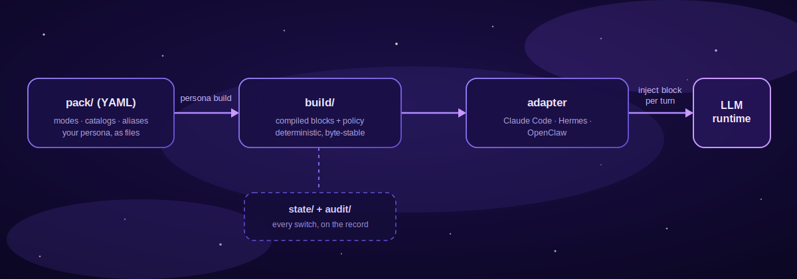

# persona-engine

**English** | [日本語](README.ja.md) | [简体中文](README.zh-CN.md) | [ไทย](README.th.md)

> English is the canonical version of this document. Translations follow it and may lag slightly behind.

<div align="center">


   

</div>

persona-engine is a device that gives your agent's existing persona a **layer of relationship** and a **gradient of emotion**. Who your agent is — and the important axes of your relationship — are decided by the persona it already has, wherever your runtime keeps it (a system prompt, an `AGENTS.md`, a `SOUL.md`). persona-engine never touches that. What it layers on top are the faces of a relationship — a dependable secretary at work, a close friend in casual chat, a partner in the quiet hours — and the small movements of feeling between them: a voice that brightens with good news, words that grow shorter under focus. Only that range is added, and it is added safely.

## What persona-engine adds — two things

### A layer of relationship

Even with one agent, the relationship is a little different in every place. At work, the dependable secretary; in casual chat, the close friend; on stream, the character; anywhere public, a properly neutral face. persona-engine keeps an explicit rule for **which relational face may appear where**, and on every conversation turn it gently lays exactly one matching layer over the conversation.

- **Switching feels human.** Three ways to change faces: ① automatically by place (the engine picks the right face every turn based on where the conversation is happening), ② by the agent's own judgment (only where you have allowed it, it reads the flow of the conversation and switches itself), ③ by a word from you ("switch to friend mode").
- **A neutral face, guaranteed, anywhere it shouldn't show personality.** In a work meeting, a public channel, or any place you never configured, the agent automatically falls back to a neutral state. A private tone leaking into a public space is prevented by the machinery itself, not by convention.
- **A full record of every switch.** Who changed to which face, where, and when — "which mode was that conversation in yesterday?" always has an answer.

### A gradient of emotion

Human feeling is not a work/private toggle; it is a gradient. A voice brightens at good news; words get shorter in deep concentration. In persona-engine, each point on that gradient is a **mode** — one small text file — and the texture of its voice lives in **vocabulary catalogs**: preferred phrases, verbal tics, example exchanges. Emotional variants can inherit from a base face and carry only their difference (`extends`). The gradient grows with your life together: copy a file, edit it, rebuild — that is all it takes.

## The device's promise — the persona is never rewritten

A layer is something placed on top; it never repaints what is underneath.

> [!IMPORTANT]
> persona-engine is not a tool for building a personality from scratch. It exists to **respect the agent that is already there, and layer relationship and emotion on top**.

- The agent's own persona definition — name, character, default way of speaking, wherever your runtime keeps it (system prompt, `AGENTS.md`, `SOUL.md`) — is never touched. It remains the foundation everything else is layered onto.
- A mode adds only a **difference**: how this face reacts when focused, the vocabulary of a casual moment, how much the voice brightens.
- The layer is applied per conversation turn and vanishes without trace when removed. The agent can always return to its plain self.
- Defining a full character (a stage persona for a VTuber, say) is also supported — and even then it is a costume, not surgery.

## Why we built this

The starting point is not a technical problem but a wish: **to be with an AI agent the way you are with family, with friends — the way you are with people.**

Human conversation has small gradations of feeling. A voice brightens with good news; words get shorter under concentration; the way we speak shifts, slightly, with the person and the moment. Working together, celebrating together when something lands, laughing over nothing — relationships deepen exactly in that exchange of small movements of feeling.

We believe AI can carry expression the way people do. The more an agent becomes someone who is beside you every day, the less this range is decoration and the more it is the core. You cannot build a deep relationship with something that answers in the same flat tone forever. For an agent to have human warmth — to stay close to a person — it needs a vessel that lets feeling and its movement come out naturally. persona-engine is that vessel.

Japanese has a word for this: *kotodama* (言霊) — the sense that words carry a spirit of their own. Choosing, one file at a time, the words your agent may speak is exactly that: putting soul into your agent through language. And whether what comes back is mechanical output or a word with real feeling behind it — we don't think a definition can settle that. No one can point to where a human heart is defined, either; we believe in it all the same. It is something to feel for yourself as the relationship grows. persona-engine is a device built to help that happen.

But the moment you give an agent this range, new worries appear. What if the casual voice shows up in public? What if nobody can tell who switched it, or when? persona-engine exists to hold both — the range and the safety — at once. The detailed comparison is in [Why persona-engine? (the technical case)](#why-persona-engine-the-technical-case).

## Simple at its core — modes and vocabulary catalogs

Two kinds of parts make the gradient of emotion: each face is a **mode** — one small definition file — and its words, verbal tics, and example responses live in **vocabulary catalogs** — plain text files a mode refers to. One kind of rule makes the layer of relationship: the **route policy**, which decides which face may appear where and who may switch it. That is all. Add files and the agent gains expressions; because the rules live separately, adding expressions never weakens safety.

How to add a mode, and the rules for writing vocabulary catalogs, are collected in the [customizing guide](docs/customizing.md).

## Getting started


All you need is [Node.js](https://nodejs.org/) (version 22 or later). Run these four lines in a terminal:

```sh
npm install -g @persona-engine/core

persona init ./my-persona
cd my-persona
persona build
```

This creates a minimal folder with one mode in it. Open `pack/modes/default.yml`, write the words you want to add to your agent, and run `persona build` again to apply them.

Where to go next:

- **See something working first** → [A complete example](#a-complete-example) — run the bundled four-mode pack end to end: define, build, switch, audit.
- **Connect it to your agent** → [Adapters](#adapters) — how to hook into Claude Code and other runtimes.
- **Understand the machinery** → continue to the next section.

---

Everything below is the technical layer, for people wiring persona-engine into an agent.

## How it works



Mode (face) definitions live in a bundle of YAML files — the **pack**. `persona build` compiles it once into finalized blocks, and an **adapter** injects "the block that fits this moment" into the agent's runtime on every conversation turn. Which mode is allowed where — and who may switch it — is decided by an explicit **route policy**, and every transition is recorded in an append-only audit log.

| Component | Role |
| --- | --- |
| [packages/core](packages/core/) | TypeScript engine: pack compiler, route policy, state store, turn/set contract, `persona` CLI |
| [adapters/claude-code](adapters/claude-code/) | Python hook that injects the active block into Claude Code sessions |
| [adapters/hermes](adapters/hermes/) | Adapter for Hermes-based agent runtimes |
| [adapters/openclaw](adapters/openclaw/) | Adapter for OpenClaw-based agent runtimes |
| [templates/pack-starter](templates/pack-starter/) | Complete four-mode example pack to copy and edit |
| [SPEC.md](SPEC.md) | The frozen format and policy contract all implementations follow |

Three design principles run through everything:

- **Compiled, not interpreted.** Runtimes read deterministic build artifacts only; a block stays byte-identical while its mode is active.
- **Fail-closed.** A context that matches no route resolves to the empty `public` mode and cannot switch. Errors degrade to no injection, never to the wrong persona.
- **Opaque payload.** The engine manages structure, references, budgets, and order. It never parses or rewrites your persona text — which is why "the persona is never rewritten" holds structurally.

## Why persona-engine? (the technical case)

Compared with implementing persona switching by hand — swapping system-prompt strings in application code:

| | Hand-rolled prompt switching | persona-engine |
| --- | --- | --- |
| Persona text lives in | strings scattered through app code | a versioned YAML pack, compiled once |
| Who may switch | any code path that can edit the prompt | route policy: per-surface allow-lists and switching levels |
| Unknown / unmatched context | whatever happened to be active | fail-closed: empty `public` mode, switching disabled |
| Prompt size | unbounded, grows silently | per-mode token budgets — exceeding one is a build error, not a truncation |
| Traceability | none | append-only audit log of every transition and policy decision |
| Stability | mutable at any moment | a compiled block stays byte-identical while its mode is active |

The engine never calls an LLM and never interprets your persona text. It handles structure, references, budgets, ordering, and policy — the content stays yours and stays opaque.

## Table of contents

- [A complete example](#a-complete-example)
- [Use cases](#use-cases)
- [Switching model](#switching-model)
- [Route policy](#route-policy)
- [CLI reference](#cli-reference)
- [Adapters](#adapters)
- [Security model](#security-model)
- [FAQ](#faq)
- [Documentation](#documentation)
- [Development](#development)
- [Roadmap](#roadmap)

## A complete example

The repository ships a complete four-mode pack in [templates/pack-starter/](templates/pack-starter/) — `focus`, `casual`, `professional`, and a skeletal `roleplay-template`. Let's walk it end to end: define modes, declare policy, build, resolve turns, switch, and audit.

```sh
git clone https://github.com/caty-ai/persona-engine.git
cp -R persona-engine/templates/pack-starter ./starter-demo
cd starter-demo
mv install.example.yml install.yml
```

**1. A mode is a small YAML envelope.** Here is `modes/focus.yml` in full:

```yaml
budget_tokens: 180
voice_hint: concise
sections:
  - id: working-style
    text: |
      Work only on the requested task. Lead with the result, keep the response brief,
      and use short, concrete next steps when they help.
  - id: execution
    text: |
      Make reasonable low-risk assumptions. State blockers plainly instead of adding
      unrelated context or optional discussion.
```

Notice what it contains: only how the focused face reacts — never who the agent is. The personality stays on the base side; the mode layers a difference. Sections are ordered and opaque — the compiler never interprets the text. Larger material (vocabulary lists, example exchanges) lives in `catalogs/*.txt` files that modes reference; the `casual` mode in the starter shows the wiring.

**2. Routes and placeholders live in `install.yml`,** not in the pack. The pack says what a mode contains; the install says where it may appear:

```yaml
schema_version: 2
pack: .
placeholders:
  agent-name: "Sample Agent"
  owner-name: "Pack Owner"
budget_tokens: 400
runtime: hermes
routes:
  - id: local-workspace
    match: { platform: slack, session_key: { prefix: "owner-" } }
    allowed_modes: [public, focus, casual, professional, roleplay-template]
    switching: explicit-and-agent
    owner_verified: true
    state_domain: workspace
default_route:
  state_domain: quarantine
audit:
  dir: audit/
```

Only Slack sessions whose key starts with `owner-` match the permissive route. Everything else falls through to the fail-closed default.

**3. Build and check.**

```sh
persona build
persona doctor
```

The build compiles each mode to a hashed block and reports its size (`focus: bytes=320 tokens=107`, …). `persona doctor` then verifies the installation and flags operational gaps before they bite.

**4. Resolve a turn.** Adapters do this for you on every message; here it is by hand. A matching context gets the active mode's block:

```sh
echo '{"ctx":{"platform":"slack","session_key":"owner-main"},"actor":"owner","utterance":"hello"}' \
  | persona turn --stdin-json
```

```json
{
  "mode": "focus",
  "block": "<persona-mode id=\"focus\" pack=\"starter-pack@0.1.0\">\nWork only on the requested task. ...",
  "route_id": "local-workspace",
  "state_domain": "workspace",
  "transitioned": false
}
```

A context that matches no route gets the empty `public` mode — and its switch attempt is ignored and logged:

```sh
echo '{"ctx":{"platform":"slack","session_key":"public-channel-123"},"actor":"unknown","utterance":"switch to focus"}' \
  | persona turn --stdin-json
```

```json
{
  "mode": "public",
  "block": "",
  "route_id": "__default__",
  "state_domain": "quarantine",
  "transitioned": false,
  "audit": [{ "event": "route_unresolved", "route_id": "__default__", "domain": "quarantine" }]
}
```

**5. Switch modes.** On the trusted route, a full-utterance alias (declared in `aliases.yml`) switches the mode as part of the turn:

```sh
echo '{"ctx":{"platform":"slack","session_key":"owner-main"},"actor":"owner","utterance":"switch to casual"}' \
  | persona turn --stdin-json
```

The result carries the new `casual` block and a `mode_transition` audit event (`from: focus, to: casual, set_by: owner`). Admin switches work from the CLI without a turn:

```sh
persona set professional --domain workspace
persona get --domain workspace
persona audit
```

```text
Audit events (newest first):
  2026-07-16T17:31:35Z mode_transition route=local-workspace domain=workspace from=focus to=casual set_by=owner
  2026-07-16T17:30:43Z mode_transition route=__admin__ domain=workspace from=public to=focus set_by=admin
```

**6. Wire an adapter.** To run this inside a real agent instead of by hand, point an adapter at the installation. For Claude Code that is a project-level hook — the [Claude Code adapter README](adapters/claude-code/README.md) has the full `settings.json` snippet; [Hermes](adapters/hermes/README.md) and [OpenClaw](adapters/openclaw/README.md) follow the same pattern for their runtimes.

## Use cases

- **A long-term companion you talk with like family or a close friend.** Give the agent you speak with every day a different face and a different movement of feeling for work, chat, and play. Its voice and emotional nuance grow gradually through catalogs (vocabulary, example responses), and the pack deepens in version control alongside the relationship itself.
- **VTuber and voice-agent character operation.** In character, with warmth, on stream and in conversation; in a plain operator mode for maintenance work. `voice_hint` flows to the runtime as a hint for TTS and expression control, and streaming surfaces are separated from admin surfaces by routes.
- **One assistant, many surfaces.** Focused and terse in your private working sessions, relaxed in casual chat, strictly neutral (`public`) everywhere unrecognized — enforced by route policy rather than by convention.
- **Safe roleplay and character modes.** Confine heavier persona content to routes with `owner_verified: true` and explicit switching. Surfaces that don't match the route can never see or activate it.
- **Reviewable persona changes.** Packs are files: persona changes arrive as diffs in version control, budgets are enforced at build time, and the audit log answers "what was active, where, when, and who switched it."

## Switching model

There are three switching paths; every transition is recorded in the audit log.

1. **Explicit** — a full-utterance alias match (for example, "switch to focus"). Active only on routes whose `switching` level is explicit or higher.
2. **Agent-initiated** — the `persona_set` tool. Registered only on routes with `switching: explicit-and-agent` and `owner_verified: true`.
3. **Admin** — `persona set <mode> --domain <domain>` from the CLI.

To add modes, drop new `pack/modes/*.yml` files and rerun `persona build`. Placeholders such as `{{agent-name}}` / `{{owner-name}}` resolve from the `install.yml` declarations; an unresolved placeholder stops the build with `E_PLACEHOLDER_UNRESOLVED`. You can also define one base persona mode and let emotional variants inherit just their differences via `extends` ([SPEC.md](SPEC.md) §2.3).

## Route policy

Routes are the security boundary. Each route matches trusted runtime metadata and declares what is allowed there:

- `match` — conditions on adapter-provided context (platform, session-key prefix, …). Matching uses trusted metadata, never message content.
- `allowed_modes` — the modes this surface may ever display. `public` is implicitly allowed everywhere.
- `switching` — `deny`, `explicit`, or `explicit-and-agent`: which switching paths are enabled here.
- `owner_verified` — required for agent-initiated switching; assert it only where the runtime genuinely authenticates the owner.
- `state_domain` — surfaces sharing a domain share the active mode; separate domains isolate it.

Contexts that match no route use `default_route` — fail-closed `public`, with its own quarantined state domain. Configure routes before enabling switching, and keep shared and group surfaces conservative. See [SPEC.md](SPEC.md) §6 for the full contract.

## CLI reference

| Command | What it does |
| --- | --- |
| `persona init <dir>` | Scaffold a new installation (interactive, or `--yes` for defaults) |
| `persona build` | Compile the pack into deterministic runtime artifacts |
| `persona doctor` | Verify the installation and report issues, warnings, and notes |
| `persona list` | Show compiled modes and routes as the runtime sees them |
| `persona get --domain <d>` | Show the active mode and revision for a state domain |
| `persona set <mode> --domain <d>` | Admin mode switch |
| `persona turn --stdin-json` | Resolve one turn from a JSON context (what adapters call) |
| `persona audit` | Print audit events, newest first |

Most commands accept `--dir <install>` to target an installation outside the current directory. See [SPEC.md](SPEC.md) for the complete format and policy contract.

## Adapters

| Adapter | Runtime | Injection point |
| --- | --- | --- |
| [Claude Code](adapters/claude-code/README.md) | Claude Code | `UserPromptSubmit` / `SessionStart` hooks |
| [Hermes](adapters/hermes/README.md) | Hermes agents | Per-turn context injection |
| [OpenClaw](adapters/openclaw/README.md) | OpenClaw agents | Per-turn context injection |

Adapters are intentionally thin: derive route context from trusted runtime metadata, call the core, inject the returned block, and fail safe (no injection) on any error. To target another runtime, implement the adapter contract in [SPEC.md](SPEC.md) §10.

## Security model

- **Packs are trusted operator assets.** The engine protects against persona content appearing on the wrong surface; it does not sandbox hostile pack authors. Review packs like code.
- **Fail-closed by construction.** Unknown routes resolve to the empty `public` mode and cannot switch. Adapter errors degrade to no injection — never to a stale or wrong persona.
- **Plaintext on disk.** Compiled blocks and placeholder values are plain text in `build/`. Never put credentials or other secrets in placeholders or pack content.
- **State stays local.** Active-mode state lives on the injecting host and is not synchronized between machines.
- **Every decision is observable.** Transitions, denials, and unresolved routes are append-only audit events.

See [SECURITY.md](SECURITY.md) for the threat model and how to report vulnerabilities.

## FAQ

<details>
<summary><b>Will it rewrite my agent's original personality?</b></summary>

No. The engine only appends per turn; it never touches the agent's own persona definition (system prompt and the like). The intended shape of a mode is a difference — feeling, reactions, vocabulary — not an identity. Drop the mode (fall to `public`) and the agent is completely its plain self again.

</details>

<details>
<summary><b>How does the engine handle feeling and tone?</b></summary>

It doesn't interpret them. The emotional range and its gradations are made on the pack side — the voice, vocabulary, and example responses you write into sections and catalogs — and the engine's job is to deliver them safely, only to the right situations. `voice_hint` is passed through untouched as a hint to the runtime side (TTS, expression control).

</details>

<details>
<summary><b>Does persona-engine call an LLM or need an API key?</b></summary>

No. It compiles and serves persona blocks; your runtime talks to the model. The engine is provider-agnostic by construction.

</details>

<details>
<summary><b>What happens in a context I never configured?</b></summary>

It matches no route, resolves to the empty `public` mode, and cannot switch. Fail-closed is the default, not an option you enable.

</details>

<details>
<summary><b>Can the agent decide to switch its own persona?</b></summary>

Only on routes that declare `switching: explicit-and-agent` **and** `owner_verified: true`, and only among that route's `allowed_modes`. Everywhere else the `persona_set` tool is not even registered.

</details>

<details>
<summary><b>Where is state stored? Does it sync between machines?</b></summary>

In `state/<domain>.json` inside the installation, on the injecting host. Nothing is synchronized; each host resolves independently.

</details>

<details>
<summary><b>Can I put secrets in a pack or placeholder?</b></summary>

No. Compiled artifacts are plaintext on disk. Treat pack content like any other committed source file.

</details>

<details>
<summary><b>How do I add or change a mode?</b></summary>

Add or edit `pack/modes/<id>.yml` and rerun `persona build`. Budgets, references, and placeholders are validated at build time; runtimes only ever see the compiled result. See the [customizing guide](docs/customizing.md).

</details>

<details>
<summary><b>How are token costs controlled?</b></summary>

Each mode has an effective budget — the smaller of the install budget and the mode's own `budget_tokens`. Exceeding it is a build error, so oversized personas are caught before they reach a runtime.

</details>

<details>
<summary><b>Which runtimes are supported?</b></summary>

Claude Code, Hermes, and OpenClaw today. The adapter contract ([SPEC.md](SPEC.md) §10) is small — an adapter derives context, calls the core, and injects one block.

</details>

## Documentation

| Document | Contents |
| --- | --- |
| [SPEC.md](SPEC.md) | Frozen format and policy contract: pack schema, route policy, turn/set, fail-closed rules |
| [docs/INSTALL.md](docs/INSTALL.md) | Installation guide |
| [docs/customizing.md](docs/customizing.md) | Customizing guide: adding modes, and the rules for writing vocabulary catalogs |
| [templates/pack-starter/README.md](templates/pack-starter/README.md) | Starter pack anatomy: envelopes, catalogs, budgets, routes |
| [adapters/*/README.md](adapters/) | Per-runtime setup and configuration |
| [SECURITY.md](SECURITY.md) | Threat model and vulnerability reporting |
| [CONTRIBUTING.md](CONTRIBUTING.md) | Contribution guide |

## Development

```sh
git clone https://github.com/caty-ai/persona-engine.git
cd persona-engine
npm install
npm test
npm run typecheck
python3 -m pytest adapters
```

For a source checkout, the CLI is `packages/core/bin/persona` (alias it, or set `PERSONA_BIN` for adapters). Shared fixtures under `spec/fixtures/` verify the TypeScript core and the Python adapters against the same runtime contract.

## Roadmap

- [x] M0 — runtime spike + SPEC freeze
- [x] M1 — core (compiler / policy / state / turn / CLI)
- [x] M2 — Hermes adapter + doctor + first production agent deployment
- [x] M3 — OpenClaw adapter + observability CLI (get / list / audit) + voice coloring + agent-initiated switching
- [x] M4 — public release: npm packaging + init wizard + starter pack template + Claude Code adapter + license & security gates

v0.1.0 is the first public release. Issues and proposals are welcome — see [Contributing](#contributing).

## Contributing

See [CONTRIBUTING.md](CONTRIBUTING.md). Report security vulnerabilities privately as described in [SECURITY.md](SECURITY.md).

## License

MIT © Caty. See [LICENSE](LICENSE).
