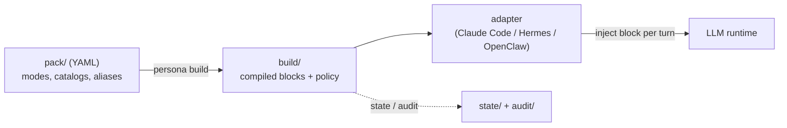

# persona-engine

**English** | [日本語](README.ja.md) | [简体中文](README.zh-CN.md) | [ไทย](README.th.md)

> English is the canonical version of this document. Translations follow it and may lag slightly behind.


persona-engine is a safe, policy-driven engine for switching personality modes in LLM agents. You describe each mode in YAML, compile the pack once with `persona build`, and let a runtime adapter inject the right compiled block into every turn. Which mode is allowed where — and who is allowed to switch it — is decided by an explicit route policy, and every transition is recorded in an append-only audit log.

## Why persona-engine?

Suppose you run one assistant across several surfaces: a private working session, a public channel, a group chat. You want it focused and terse while you work, relaxed in casual conversation, and strictly neutral anywhere public. The obvious approach — swapping system-prompt strings in application code — works until it doesn't:

- A "casual" prompt intended for a private session leaks into a public channel because a code path forgot to check the context.
- Nobody can answer "which persona was active in that conversation last Tuesday?" because nothing was recorded.
- Prompts grow without bound, and the persona silently drifts mid-session as someone edits a string in place.

persona-engine turns persona management from scattered strings into a compiled, policy-checked artifact:

| | Hand-rolled prompt switching | persona-engine |
| --- | --- | --- |
| Persona text lives in | strings scattered through app code | a versioned YAML pack, compiled once |
| Who may switch | any code path that can edit the prompt | route policy: per-surface allow-lists and switching levels |
| Unknown / unmatched context | whatever happened to be active | fail-closed: empty `public` mode, switching disabled |
| Prompt size | unbounded, grows silently | per-mode token budgets — exceeding one is a build error, not a truncation |
| Traceability | none | append-only audit log of every transition and policy decision |
| Stability | mutable at any moment | a compiled block stays byte-identical while its mode is active |

The engine never calls an LLM and never interprets your persona text. It handles structure, references, budgets, ordering, and policy — the content stays yours and stays opaque.

## How it works



An adapter derives route context from trusted runtime metadata (platform, session key), asks the core to resolve a block for that context, and injects the block at the runtime's request-scoped extension point. Runtime paths read compiled artifacts only — never YAML.

| Component | Role |
| --- | --- |
| [packages/core](packages/core/) | TypeScript engine: pack compiler, route policy, state store, turn/set contract, `persona` CLI |
| [adapters/claude-code](adapters/claude-code/) | Python hook that injects the active block into Claude Code sessions |
| [adapters/hermes](adapters/hermes/) | Adapter for Hermes-based agent runtimes |
| [adapters/openclaw](adapters/openclaw/) | Adapter for OpenClaw-based agent runtimes |
| [templates/pack-starter](templates/pack-starter/) | Complete four-mode example pack to copy and edit |
| [SPEC.md](SPEC.md) | The frozen format and policy contract all implementations follow |

Three design principles run through everything:

- **Compiled, not interpreted.** Runtimes read deterministic build artifacts; a block stays byte-identical while its mode is active.
- **Fail-closed.** A context that matches no route resolves to the empty `public` mode and cannot switch. Errors degrade to no injection, never to the wrong persona.
- **Opaque payload.** The engine manages structure, references, budgets, and order. It never parses or rewrites your persona text.

## Table of contents

- [Features](#features)
- [Quick start](#quick-start)
- [A complete example](#a-complete-example)
- [Use cases](#use-cases)
- [Switching model](#switching-model)
- [Route policy](#route-policy)
- [CLI reference](#cli-reference)
- [Adapters](#adapters)
- [Security model](#security-model)
- [FAQ](#faq)
- [Documentation](#documentation)
- [Development](#development)
- [Roadmap](#roadmap)

## Features

- **Declarative packs** — each mode is a small YAML envelope: ordered sections, optional token budget and voice hint, reusable catalog files for vocabulary and examples.
- **One-shot compilation** — `persona build` resolves placeholders, enforces budgets, and emits hashed, deterministic artifacts. Broken references and unresolved placeholders stop the build.
- **Route policy** — per-surface allow-lists decide which modes may appear where, which switching paths are enabled, and which state domain a surface shares.
- **Three switching paths, one policy gate** — explicit user aliases, an agent-initiated tool, and admin CLI all pass through the same core policy evaluation.
- **Audit built in** — every transition and every policy denial is an event in an append-only JSONL log, inspectable with `persona audit`.
- **Runtime-agnostic** — the core never talks to a model API. Adapters exist for three runtimes today, and the adapter contract in [SPEC.md](SPEC.md) is small.

## Quick start

Requires Node.js 22 or later.

```sh
npm install -g @persona-engine/core

persona init ./my-persona
cd my-persona
persona build
persona list
```

`persona init` scaffolds a minimal installation: a pack with one `default` mode, an `install.yml` with a single conservative route, and empty `state/` and `audit/` directories. After `persona build`, `persona list` shows what the runtime will see:

```text
Modes:
  default: bytes=117 tokens=39 voice_hint=no data_error=false

Routes:
  cli-admin: allowed_modes=[public, default] switching=deny owner_verified=no data_error=false

Note: public is implicitly allowed on every route, whether or not allowed_modes lists it.
```

Edit `pack/modes/default.yml`, rerun `persona build`, and you have a working single-mode installation. The next section grows this into something real.

## A complete example

The repository ships a complete four-mode pack in [templates/pack-starter/](templates/pack-starter/) — `focus`, `casual`, `professional`, and a skeletal `roleplay-template`. Let's walk it end to end: define modes, declare policy, build, resolve turns, switch, and audit.

```sh
git clone https://github.com/caty-ai/persona-engine.git
cp -R persona-engine/templates/pack-starter ./starter-demo
cd starter-demo
mv install.example.yml install.yml
```

**1. A mode is a small YAML envelope.** Here is `modes/focus.yml` in full:

```yaml
budget_tokens: 180
voice_hint: concise
sections:
  - id: working-style
    text: |
      Work only on the requested task. Lead with the result, keep the response brief,
      and use short, concrete next steps when they help.
  - id: execution
    text: |
      Make reasonable low-risk assumptions. State blockers plainly instead of adding
      unrelated context or optional discussion.
```

Sections are ordered and opaque — the compiler never interprets the text. Larger material (vocabulary lists, example exchanges) lives in `catalogs/*.txt` files that modes reference; the `casual` mode in the starter shows the wiring.

**2. Routes and placeholders live in `install.yml`,** not in the pack. The pack says what a mode contains; the install says where it may appear:

```yaml
schema_version: 2
pack: .
placeholders:
  agent-name: "Sample Agent"
  owner-name: "Pack Owner"
budget_tokens: 400
runtime: hermes
routes:
  - id: local-workspace
    match: { platform: slack, session_key: { prefix: "owner-" } }
    allowed_modes: [public, focus, casual, professional, roleplay-template]
    switching: explicit-and-agent
    owner_verified: true
    state_domain: workspace
default_route:
  state_domain: quarantine
audit:
  dir: audit/
```

Only Slack sessions whose key starts with `owner-` match the permissive route. Everything else falls through to the fail-closed default.

**3. Build and check.**

```sh
persona build
persona doctor
```

The build compiles each mode to a hashed block and reports its size (`focus: bytes=320 tokens=107`, …). `persona doctor` then verifies the installation and flags operational gaps before they bite.

**4. Resolve a turn.** Adapters do this for you on every message; here it is by hand. A matching context gets the active mode's block:

```sh
echo '{"ctx":{"platform":"slack","session_key":"owner-main"},"actor":"owner","utterance":"hello"}' \
  | persona turn --stdin-json
```

```json
{
  "mode": "focus",
  "block": "<persona-mode id=\"focus\" pack=\"starter-pack@0.1.0\">\nWork only on the requested task. ...",
  "route_id": "local-workspace",
  "state_domain": "workspace",
  "transitioned": false
}
```

A context that matches no route gets the empty `public` mode — and its switch attempt is ignored and logged:

```sh
echo '{"ctx":{"platform":"slack","session_key":"public-channel-123"},"actor":"unknown","utterance":"switch to focus"}' \
  | persona turn --stdin-json
```

```json
{
  "mode": "public",
  "block": "",
  "route_id": "__default__",
  "state_domain": "quarantine",
  "transitioned": false,
  "audit": [{ "event": "route_unresolved", "route_id": "__default__", "domain": "quarantine" }]
}
```

**5. Switch modes.** On the trusted route, a full-utterance alias (declared in `aliases.yml`) switches the mode as part of the turn:

```sh
echo '{"ctx":{"platform":"slack","session_key":"owner-main"},"actor":"owner","utterance":"switch to casual"}' \
  | persona turn --stdin-json
```

The result carries the new `casual` block and a `mode_transition` audit event (`from: focus, to: casual, set_by: owner`). Admin switches work from the CLI without a turn:

```sh
persona set professional --domain workspace
persona get --domain workspace
persona audit
```

```text
Audit events (newest first):
  2026-07-16T17:31:35Z mode_transition route=local-workspace domain=workspace from=focus to=casual set_by=owner
  2026-07-16T17:30:43Z mode_transition route=__admin__ domain=workspace from=public to=focus set_by=admin
```

**6. Wire an adapter.** To run this inside a real agent instead of by hand, point an adapter at the installation. For Claude Code that is a project-level hook — the [Claude Code adapter README](adapters/claude-code/README.md) has the full `settings.json` snippet; [Hermes](adapters/hermes/README.md) and [OpenClaw](adapters/openclaw/README.md) follow the same pattern for their runtimes.

## Use cases

- **One assistant, many surfaces.** Focused and terse in your private working sessions, relaxed in casual chat, strictly neutral (`public`) everywhere unrecognized — enforced by route policy rather than by convention.
- **Task-shaped tone presets.** Keep `focus` / `casual` / `professional` variants of the same assistant and switch per task with a single utterance, without redeploying or editing config.
- **Safe roleplay and character modes.** Confine heavier persona content to routes with `owner_verified: true` and explicit switching. Surfaces that don't match the route can never see or activate it.
- **Reviewable persona changes.** Packs are files: persona changes arrive as diffs in version control, budgets are enforced at build time, and the audit log answers "what was active, where, when, and who switched it."

## Switching model

There are three switching paths; every transition is recorded in the audit log.

1. **Explicit** — a full-utterance alias match (for example, "switch to focus"). Active only on routes whose `switching` level is explicit or higher.
2. **Agent-initiated** — the `persona_set` tool. Registered only on routes with `switching: explicit-and-agent` and `owner_verified: true`.
3. **Admin** — `persona set <mode> --domain <domain>` from the CLI.

To add modes, drop new `pack/modes/*.yml` files and rerun `persona build`. Placeholders such as `{{agent-name}}` / `{{owner-name}}` resolve from the `install.yml` declarations; an unresolved placeholder stops the build with `E_PLACEHOLDER_UNRESOLVED`.

## Route policy

Routes are the security boundary. Each route matches trusted runtime metadata and declares what is allowed there:

- `match` — conditions on adapter-provided context (platform, session-key prefix, …). Matching uses trusted metadata, never message content.
- `allowed_modes` — the modes this surface may ever display. `public` is implicitly allowed everywhere.
- `switching` — `deny`, `explicit`, or `explicit-and-agent`: which switching paths are enabled here.
- `owner_verified` — required for agent-initiated switching; assert it only where the runtime genuinely authenticates the owner.
- `state_domain` — surfaces sharing a domain share the active mode; separate domains isolate it.

Contexts that match no route use `default_route` — fail-closed `public`, with its own quarantined state domain. Configure routes before enabling switching, and keep shared and group surfaces conservative. See [SPEC.md](SPEC.md) §6 for the full contract.

## CLI reference

| Command | What it does |
| --- | --- |
| `persona init <dir>` | Scaffold a new installation (interactive, or `--yes` for defaults) |
| `persona build` | Compile the pack into deterministic runtime artifacts |
| `persona doctor` | Verify the installation and report issues, warnings, and notes |
| `persona list` | Show compiled modes and routes as the runtime sees them |
| `persona get --domain <d>` | Show the active mode and revision for a state domain |
| `persona set <mode> --domain <d>` | Admin mode switch |
| `persona turn --stdin-json` | Resolve one turn from a JSON context (what adapters call) |
| `persona audit` | Print audit events, newest first |

Most commands accept `--dir <install>` to target an installation outside the current directory. See [SPEC.md](SPEC.md) for the complete format and policy contract.

## Adapters

| Adapter | Runtime | Injection point |
| --- | --- | --- |
| [Claude Code](adapters/claude-code/README.md) | Claude Code | `UserPromptSubmit` / `SessionStart` hooks |
| [Hermes](adapters/hermes/README.md) | Hermes agents | Per-turn context injection |
| [OpenClaw](adapters/openclaw/README.md) | OpenClaw agents | Per-turn context injection |

Adapters are intentionally thin: derive route context from trusted runtime metadata, call the core, inject the returned block, and fail safe (no injection) on any error. To target another runtime, implement the adapter contract in [SPEC.md](SPEC.md) §10.

## Security model

- **Packs are trusted operator assets.** The engine protects against persona content appearing on the wrong surface; it does not sandbox hostile pack authors. Review packs like code.
- **Fail-closed by construction.** Unknown routes resolve to the empty `public` mode and cannot switch. Adapter errors degrade to no injection — never to a stale or wrong persona.
- **Plaintext on disk.** Compiled blocks and placeholder values are plain text in `build/`. Never put credentials or other secrets in placeholders or pack content.
- **State stays local.** Active-mode state lives on the injecting host and is not synchronized between machines.
- **Every decision is observable.** Transitions, denials, and unresolved routes are append-only audit events.

See [SECURITY.md](SECURITY.md) for the threat model and how to report vulnerabilities.

## FAQ

**Does persona-engine call an LLM or need an API key?**
No. It compiles and serves persona blocks; your runtime talks to the model. The engine is provider-agnostic by construction.

**What happens in a context I never configured?**
It matches no route, resolves to the empty `public` mode, and cannot switch. Fail-closed is the default, not an option you enable.

**Can the agent decide to switch its own persona?**
Only on routes that declare `switching: explicit-and-agent` **and** `owner_verified: true`, and only among that route's `allowed_modes`. Everywhere else the `persona_set` tool is not even registered.

**Where is state stored? Does it sync between machines?**
In `state/<domain>.json` inside the installation, on the injecting host. Nothing is synchronized; each host resolves independently.

**Can I put secrets in a pack or placeholder?**
No. Compiled artifacts are plaintext on disk. Treat pack content like any other committed source file.

**How do I add or change a mode?**
Add or edit `pack/modes/<id>.yml` and rerun `persona build`. Budgets, references, and placeholders are validated at build time; runtimes only ever see the compiled result.

**How are token costs controlled?**
Each mode has an effective budget — the smaller of the install budget and the mode's own `budget_tokens`. Exceeding it is a build error, so oversized personas are caught before they reach a runtime.

**Which runtimes are supported?**
Claude Code, Hermes, and OpenClaw today. The adapter contract ([SPEC.md](SPEC.md) §10) is small — an adapter derives context, calls the core, and injects one block.

## Documentation

| Document | Contents |
| --- | --- |
| [SPEC.md](SPEC.md) | Frozen format and policy contract: pack schema, route policy, turn/set, fail-closed rules |
| [docs/INSTALL.md](docs/INSTALL.md) | Installation guide |
| [templates/pack-starter/README.md](templates/pack-starter/README.md) | Starter pack anatomy: envelopes, catalogs, budgets, routes |
| [adapters/*/README.md](adapters/) | Per-runtime setup and configuration |
| [SECURITY.md](SECURITY.md) | Threat model and vulnerability reporting |
| [CONTRIBUTING.md](CONTRIBUTING.md) | Contribution guide |

## Development

```sh
git clone https://github.com/caty-ai/persona-engine.git
cd persona-engine
npm install
npm test
npm run typecheck
python3 -m pytest adapters
```

For a source checkout, the CLI is `packages/core/bin/persona` (alias it, or set `PERSONA_BIN` for adapters). Shared fixtures under `spec/fixtures/` verify the TypeScript core and the Python adapters against the same runtime contract.

## Roadmap

- [x] M0 — runtime spike + SPEC freeze
- [x] M1 — core (compiler / policy / state / turn / CLI)
- [x] M2 — Hermes adapter + doctor + first production agent deployment
- [x] M3 — OpenClaw adapter + observability CLI (get / list / audit) + voice coloring + agent-initiated switching
- [x] M4 — public release: npm packaging + init wizard + starter pack template + Claude Code adapter + license & security gates

v0.1.0 is the first public release. Issues and proposals are welcome — see [Contributing](#contributing).

## Contributing

See [CONTRIBUTING.md](CONTRIBUTING.md). Report security vulnerabilities privately as described in [SECURITY.md](SECURITY.md).

## License

MIT © Caty. See [LICENSE](LICENSE).
