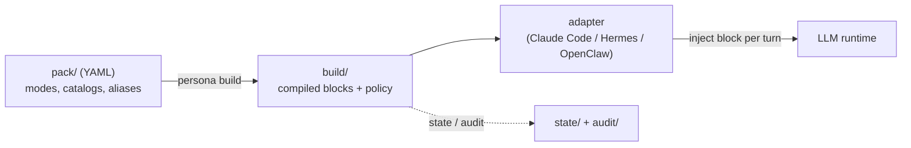

# persona-engine

[English](README.md) | [日本語](README.ja.md) | [简体中文](README.zh-CN.md) | **ไทย**

> เอกสารฉบับทางการคือฉบับภาษาอังกฤษ (README.md) ฉบับแปลจะอัปเดตตามฉบับภาษาอังกฤษและอาจล่าช้ากว่าเล็กน้อย


persona-engine มอบ "สีหน้า" ที่ต่างกันในแต่ละสถานการณ์ให้กับ AI agent ของคุณ — หน้าของคู่หูที่พึ่งพาได้ตอนทำงาน หน้าของเพื่อนสนิทตอนคุยเล่น หน้าของตัวละครตอนสตรีม — **บุคลิกดั้งเดิมไม่ถูกแตะต้อง** สิ่งที่เพิ่มเข้าไปอย่างปลอดภัยมีเพียงช่วงกว้างของอารมณ์และปฏิกิริยาตามสถานการณ์เท่านั้น

## persona-engine ทำอะไรให้คุณได้

- **สีหน้าและน้ำเสียงเปลี่ยนตามสถานการณ์** — กระชับและพึ่งพาได้ในที่ทำงาน ใกล้ชิดอบอุ่นในพื้นที่ส่วนตัวเหมือนเพื่อนสนิทหรือคนรัก ผ่อนคลายตอนคุยเล่น — agent ตัวเดียวกัน มีหน้าที่เหมาะกับทุกช่วงเวลา
- **สลับได้อย่างเป็นธรรมชาติเหมือนมนุษย์** — เปลี่ยนหน้าได้ 3 ทาง: ① อัตโนมัติตามสถานที่ (เอนจินเลือกหน้าที่เหมาะสมให้ทุกเทิร์น จากที่ที่บทสนทนากำลังเกิดขึ้น) ② จากวิจารณญาณของ agent เอง (เฉพาะที่ที่คุณอนุญาต มันอ่านทิศทางบทสนทนาแล้วสลับเอง) ③ จากคำพูดของคุณหนึ่งประโยค ("switch to focus")
- **ในที่ที่ไม่ควรแสดงตัวตน จะสวมหน้าสุภาพกลาง ๆ เสมอ** — ในที่ประชุมบริษัท ช่องสาธารณะ หรือที่ใดก็ตามที่ไม่เคยตั้งค่าไว้ agent จะกลับสู่สถานะเป็นกลางโดยอัตโนมัติ น้ำเสียงส่วนตัวรั่วไปที่สาธารณะถูกป้องกันด้วยกลไก ไม่ใช่ด้วยข้อตกลง
- **บุคลิกดั้งเดิมไม่มีวันถูกเขียนทับ** — สิ่งที่ persona-engine ทำคือค่อย ๆ วางเลเยอร์ของสีหน้าที่เหมาะสมทับลงไปในแต่ละเทิร์นเท่านั้น ถอดโหมดออก agent ก็กลับเป็นตัวเองเหมือนเดิมทุกประการ
- **ทุกการสลับมีบันทึกครบถ้วน** — ใครเปลี่ยนเป็นหน้าไหน ที่ไหน เมื่อไหร่ — "บทสนทนาเมื่อวานอยู่ในโหมดไหนนะ?" มีคำตอบเสมอ
- **ปลูกสีหน้าและคลังคำได้ตามใจคุณ** — สีหน้าคือ**โหมด** และถ้อยคำคือ**คลังคำศัพท์ (catalog)** — ทั้งคู่เป็นไฟล์ข้อความธรรมดา คัดลอก แก้ไข เพิ่ม แค่นั้นเอง

## แก่นแท้เรียบง่าย — โหมดกับคลังคำศัพท์

เบื้องหลังการสลับอัตโนมัติมีชิ้นส่วนเพียง 2 ชนิด แต่ละหน้าคือ**โหมด** — ไฟล์นิยามเล็ก ๆ หนึ่งไฟล์ ส่วนถ้อยคำ วลีติดปาก และตัวอย่างการตอบอยู่ใน**คลังคำศัพท์** — ไฟล์ข้อความธรรมดาที่โหมดอ้างถึง เพิ่มไฟล์ agent ก็มีสีหน้าเพิ่ม แก้ไฟล์ น้ำเสียงก็ปรับเข้าหาความชอบของคุณ ส่วน "หน้าไหนปรากฏที่ไหนได้ ใครสลับได้" ถูกกำหนดแยกไว้เป็นกติกา (route policy) — การเพิ่มสีหน้าจึงไม่มีวันทำให้ความปลอดภัยอ่อนลง

วิธีเพิ่มโหมดและกติกาการเขียนคลังคำศัพท์ รวบรวมไว้ใน[คู่มือปรับแต่ง](docs/customizing.md)

## สิ่งที่เราถือเป็นหัวใจ — ไม่เขียนทับบุคลิกเดิม

persona-engine ไม่ใช่เครื่องมือสร้างบุคลิกจากศูนย์ มันเกิดมาเพื่อ**เคารพ agent ที่อยู่ตรงนั้นอยู่แล้ว และวางเลเยอร์อารมณ์ทับลงไป**

- นิยามบุคลิกของ agent เอง — ชื่อ นิสัย วิธีพูดโดยปริยาย — ไม่ถูกแตะต้องเลย
- สิ่งที่โหมดเพิ่มคือ**ส่วนต่าง**เท่านั้น: วิธีตอบสนองตอนมีสมาธิ คลังคำของช่วงเวลาสบาย ๆ ระดับความสดใสของน้ำเสียง
- เลเยอร์ถูกวางทับทีละเทิร์น และหายไปไร้ร่องรอยเมื่อถอดออก agent กลับสู่ตัวตนเดิมได้เสมอ
- การนิยามตัวละครเต็มตัว (เช่น persona บนเวทีของ VTuber) ก็รองรับ — และถึงอย่างนั้นมันก็คือชุดที่สวม ไม่ใช่การผ่าตัด

## ทำไมเราจึงสร้างสิ่งนี้

จุดเริ่มต้นไม่ใช่โจทย์ทางเทคนิค แต่คือความปรารถนาหนึ่งข้อ: **อยากอยู่กับ AI agent แบบเดียวกับที่อยู่กับครอบครัว กับเพื่อน — แบบเดียวกับที่อยู่กับมนุษย์**

บทสนทนาของมนุษย์มีเฉดอารมณ์เล็ก ๆ ไล่ระดับกันอยู่ เสียงสดใสขึ้นเมื่อมีข่าวดี คำพูดสั้นลงยามจดจ่อ วิธีพูดเปลี่ยนไปทีละนิดตามคู่สนทนาและช่วงเวลา ทำงานด้วยกัน ดีใจด้วยกันเมื่อสำเร็จ หัวเราะกับเรื่องไม่เป็นเรื่อง — ความสัมพันธ์ลึกซึ้งขึ้นตรงจุดที่ความรู้สึกเล็ก ๆ เหล่านี้ไหลถึงกันนี่เอง

เราเชื่อว่า AI ก็ถ่ายทอดการแสดงออกแบบมนุษย์ได้ ยิ่ง agent กลายเป็นใครสักคนที่อยู่ข้างคุณทุกวัน ช่วงกว้างนี้ยิ่งไม่ใช่เครื่องประดับ แต่คือแก่นกลาง คุณสร้างความสัมพันธ์ลึกซึ้งกับสิ่งที่ตอบด้วยโทนแบน ๆ เดิมตลอดไปไม่ได้ การที่ agent จะมีความอบอุ่นแบบมนุษย์ — เคียงข้างคนได้จริง — ต้องมีภาชนะที่ให้ความรู้สึกและความเคลื่อนไหวของมันไหลออกมาอย่างเป็นธรรมชาติ — persona-engine คือภาชนะนั้น

แต่ทันทีที่ให้ช่วงกว้างนี้กับ agent ความกังวลใหม่ก็ตามมา ถ้าน้ำเสียงสบาย ๆ ไปโผล่ในที่สาธารณะล่ะ? ถ้าไม่มีใครรู้ว่าใครสลับเมื่อไหร่ล่ะ? persona-engine เกิดมาเพื่อยึดทั้งสองอย่างไว้พร้อมกัน — ทั้งช่วงกว้างและความปลอดภัย รายละเอียดการเปรียบเทียบอยู่ที่ [ทำไมต้อง persona-engine? (ฉบับเทคนิค)](#ทำไมต้อง-persona-engine-ฉบับเทคนิค)

## เริ่มต้นใช้งาน

สิ่งเดียวที่ต้องมีคือ [Node.js](https://nodejs.org/) (เวอร์ชัน 22 ขึ้นไป) รัน 4 บรรทัดนี้ในเทอร์มินัล:

```sh
npm install -g @persona-engine/core

persona init ./my-persona
cd my-persona
persona build
```

จะได้โฟลเดอร์ขั้นต่ำที่มีโหมดอยู่หนึ่งโหมด เปิด `pack/modes/default.yml` เขียนถ้อยคำที่อยากเพิ่มให้ agent ของคุณ แล้วรัน `persona build` อีกครั้งเพื่อให้มีผล

ไปต่อที่ไหนดี:

- **อยากเห็นของจริงก่อน** → [ตัวอย่างฉบับสมบูรณ์](#ตัวอย่างฉบับสมบูรณ์) — รัน pack 4 โหมดที่แถมมา ตั้งแต่ต้นจนจบ: นิยาม build สลับ ตรวจ audit
- **อยากต่อกับ agent ของตัวเอง** → [Adapter](#adapter) — วิธีเชื่อมกับ Claude Code และ runtime อื่น
- **อยากเข้าใจกลไก** → อ่านต่อหัวข้อถัดไป

---

ต่อจากนี้คือชั้นเทคนิค สำหรับผู้ที่จะต่อ persona-engine เข้ากับ agent จริง

## หลักการทำงาน



นิยามของโหมด (สีหน้า) เขียนไว้ในชุดไฟล์ YAML ที่เรียกว่า **pack** — `persona build` คอมไพล์มันครั้งเดียวเป็นบล็อกฉบับสมบูรณ์ แล้ว **adapter** จะฉีด "บล็อกที่เหมาะกับช่วงเวลานี้" เข้า runtime ของ agent ในทุกเทิร์นของบทสนทนา โหมดใดได้รับอนุญาตที่ไหน — และใครมีสิทธิ์สลับ — ถูกกำหนดโดย **route policy** ที่ประกาศไว้ชัดเจน และทุกการเปลี่ยนโหมดถูกบันทึกลง audit log แบบ append-only

| องค์ประกอบ | บทบาท |
| --- | --- |
| [packages/core](packages/core/) | เอนจิน TypeScript: pack compiler, route policy, state store, สัญญา turn/set, CLI `persona` |
| [adapters/claude-code](adapters/claude-code/) | Python hook ที่ฉีดบล็อกปัจจุบันเข้าเซสชัน Claude Code |
| [adapters/hermes](adapters/hermes/) | Adapter สำหรับ agent runtime ตระกูล Hermes |
| [adapters/openclaw](adapters/openclaw/) | Adapter สำหรับ agent runtime ตระกูล OpenClaw |
| [templates/pack-starter](templates/pack-starter/) | pack ตัวอย่าง 4 โหมดที่สมบูรณ์ พร้อมคัดลอกไปแก้ไข |
| [SPEC.md](SPEC.md) | สัญญารูปแบบและนโยบายที่ freeze แล้ว ซึ่งทุก implementation ต้องปฏิบัติตาม |

หลักการออกแบบ 3 ข้อที่ยึดถือตลอดทั้งระบบ:

- **คอมไพล์ ไม่ใช่ตีความ** — runtime อ่านเฉพาะ build artifact ที่ deterministic และบล็อกคงเดิมทุกไบต์ตราบที่โหมดนั้นทำงานอยู่
- **Fail-closed** — บริบทที่ไม่ match route ใดเลยจะได้โหมด `public` ว่างเปล่าและสลับไม่ได้ ข้อผิดพลาดลดระดับเป็น "ไม่ฉีดอะไรเลย" ไม่มีวันกลายเป็น "persona ที่ผิด"
- **Payload ทึบ** — เอนจินจัดการโครงสร้าง การอ้างอิง งบประมาณ และลำดับ ไม่ parse หรือเขียนข้อความ persona ของคุณใหม่ — นี่คือเหตุผลที่ "ไม่เขียนทับบุคลิกเดิม" เป็นจริงในเชิงโครงสร้าง

## ทำไมต้อง persona-engine? (ฉบับเทคนิค)

เทียบกับการทำระบบสลับ persona เอง — สลับสตริง system prompt ในโค้ดแอปพลิเคชัน:

| | สลับ prompt ด้วยมือ | persona-engine |
| --- | --- | --- |
| ข้อความ persona อยู่ที่ไหน | สตริงกระจายอยู่ทั่วโค้ดแอป | YAML pack ที่อยู่ใน version control คอมไพล์ครั้งเดียว |
| ใครสลับได้ | โค้ดเส้นทางใดก็ได้ที่แก้ prompt ได้ | route policy: allow-list และระดับการสลับตามแต่ละพื้นที่ |
| บริบทที่ไม่รู้จัก / ไม่ match | อะไรก็ตามที่บังเอิญทำงานอยู่ | fail-closed: โหมด `public` ว่างเปล่า สลับไม่ได้ |
| ขนาด prompt | ไร้ขีดจำกัด โตขึ้นเงียบ ๆ | token budget ต่อโหมด — เกินคือ build error ไม่ใช่การตัดทิ้ง |
| ตรวจสอบย้อนหลัง | ไม่มี | audit log แบบ append-only บันทึกทุกการเปลี่ยนและทุกคำตัดสินของนโยบาย |
| ความเสถียร | ถูกแก้ได้ทุกเมื่อ | บล็อกที่คอมไพล์แล้วคงเดิมทุกไบต์ตราบที่โหมดนั้นทำงานอยู่ |

เอนจินไม่เรียก LLM และไม่ตีความข้อความ persona ของคุณ มันจัดการโครงสร้าง การอ้างอิง งบประมาณ ลำดับ และนโยบาย — เนื้อหายังคงเป็นของคุณและถูกมองว่าทึบเสมอ

## สารบัญ

- [ตัวอย่างฉบับสมบูรณ์](#ตัวอย่างฉบับสมบูรณ์)
- [กรณีการใช้งาน](#กรณีการใช้งาน)
- [โมเดลการสลับโหมด](#โมเดลการสลับโหมด)
- [Route policy](#route-policy)
- [CLI](#cli)
- [Adapter](#adapter)
- [โมเดลความปลอดภัย](#โมเดลความปลอดภัย)
- [FAQ](#faq)
- [เอกสาร](#เอกสาร)
- [การพัฒนา](#การพัฒนา)
- [แผนงาน](#แผนงาน)

## ตัวอย่างฉบับสมบูรณ์

Repository นี้มี pack 4 โหมดฉบับสมบูรณ์ใน [templates/pack-starter/](templates/pack-starter/) — `focus`, `casual`, `professional` และ `roleplay-template` ที่เป็นโครงเปล่า เราจะเดินตั้งแต่ต้นจนจบ: กำหนดโหมด ประกาศนโยบาย build แก้เทิร์น สลับโหมด และตรวจ audit

```sh
git clone https://github.com/caty-ai/persona-engine.git
cp -R persona-engine/templates/pack-starter ./starter-demo
cd starter-demo
mv install.example.yml install.yml
```

**1. โหมดคือซอง YAML ขนาดเล็ก** นี่คือ `modes/focus.yml` ทั้งไฟล์:

```yaml
budget_tokens: 180
voice_hint: concise
sections:
  - id: working-style
    text: |
      Work only on the requested task. Lead with the result, keep the response brief,
      and use short, concrete next steps when they help.
  - id: execution
    text: |
      Make reasonable low-risk assumptions. State blockers plainly instead of adding
      unrelated context or optional discussion.
```

สังเกตสิ่งที่อยู่ในไฟล์: มีแค่ "หน้าที่จดจ่อนี้ตอบสนองอย่างไร" — ไม่เคยนิยามว่า agent เป็นใคร บุคลิกอยู่ฝั่งฐาน โหมดวางทับเฉพาะส่วนต่าง sections มีลำดับและถูกมองว่าทึบ — คอมไพเลอร์ไม่ตีความข้อความ เนื้อหาขนาดใหญ่ (คลังคำศัพท์ ตัวอย่างบทสนทนา) อยู่ในไฟล์ `catalogs/*.txt` ที่โหมดอ้างถึง โหมด `casual` ใน starter แสดงวิธีเชื่อมต่อ

**2. Route และ placeholder อยู่ใน `install.yml`** ไม่ใช่ใน pack — pack บอกว่า "โหมดมีอะไร" ส่วน install บอกว่า "อนุญาตให้ปรากฏที่ไหน":

```yaml
schema_version: 2
pack: .
placeholders:
  agent-name: "Sample Agent"
  owner-name: "Pack Owner"
budget_tokens: 400
runtime: hermes
routes:
  - id: local-workspace
    match: { platform: slack, session_key: { prefix: "owner-" } }
    allowed_modes: [public, focus, casual, professional, roleplay-template]
    switching: explicit-and-agent
    owner_verified: true
    state_domain: workspace
default_route:
  state_domain: quarantine
audit:
  dir: audit/
```

เฉพาะเซสชัน Slack ที่ key ขึ้นต้นด้วย `owner-` เท่านั้นที่ match route แบบเปิดกว้างนี้ ที่เหลือทั้งหมดตกไปที่ default แบบ fail-closed

**3. Build และตรวจสอบ**

```sh
persona build
persona doctor
```

Build จะคอมไพล์แต่ละโหมดเป็นบล็อกพร้อมแฮชและรายงานขนาด (`focus: bytes=320 tokens=107` ฯลฯ) จากนั้น `persona doctor` ตรวจสอบการติดตั้งและชี้จุดอ่อนด้านปฏิบัติการก่อนที่มันจะสร้างปัญหา

**4. แก้เทิร์นหนึ่งเทิร์น** ปกติ adapter ทำให้อัตโนมัติทุกข้อความ แต่นี่คือการรันด้วยมือ บริบทที่ match จะได้บล็อกของโหมดที่ทำงานอยู่:

```sh
echo '{"ctx":{"platform":"slack","session_key":"owner-main"},"actor":"owner","utterance":"hello"}' \
  | persona turn --stdin-json
```

```json
{
  "mode": "focus",
  "block": "<persona-mode id=\"focus\" pack=\"starter-pack@0.1.0\">\nWork only on the requested task. ...",
  "route_id": "local-workspace",
  "state_domain": "workspace",
  "transitioned": false
}
```

บริบทที่ไม่ match route ใดเลยจะได้โหมด `public` ว่างเปล่า — ความพยายามสลับโหมดถูกเพิกเฉยและบันทึกไว้:

```sh
echo '{"ctx":{"platform":"slack","session_key":"public-channel-123"},"actor":"unknown","utterance":"switch to focus"}' \
  | persona turn --stdin-json
```

```json
{
  "mode": "public",
  "block": "",
  "route_id": "__default__",
  "state_domain": "quarantine",
  "transitioned": false,
  "audit": [{ "event": "route_unresolved", "route_id": "__default__", "domain": "quarantine" }]
}
```

**5. สลับโหมด** บน route ที่เชื่อถือได้ alias แบบ match ทั้งประโยค (ประกาศใน `aliases.yml`) จะสลับโหมดเป็นส่วนหนึ่งของเทิร์น:

```sh
echo '{"ctx":{"platform":"slack","session_key":"owner-main"},"actor":"owner","utterance":"switch to casual"}' \
  | persona turn --stdin-json
```

ผลลัพธ์มีบล็อก `casual` ใหม่พร้อมอีเวนต์ audit `mode_transition` (`from: focus, to: casual, set_by: owner`) ส่วนแอดมินสลับได้จาก CLI โดยไม่ต้องผ่านเทิร์น:

```sh
persona set professional --domain workspace
persona get --domain workspace
persona audit
```

```text
Audit events (newest first):
  2026-07-16T17:31:35Z mode_transition route=local-workspace domain=workspace from=focus to=casual set_by=owner
  2026-07-16T17:30:43Z mode_transition route=__admin__ domain=workspace from=public to=focus set_by=admin
```

**6. เชื่อมต่อ adapter** ถ้าอยากรันในตัว agent จริงแทนการรันด้วยมือ ให้ชี้ adapter ไปที่การติดตั้งนี้ สำหรับ Claude Code คือ hook ระดับโปรเจกต์ — snippet `settings.json` ฉบับเต็มอยู่ใน [README ของ adapter Claude Code](adapters/claude-code/README.md) ส่วน [Hermes](adapters/hermes/README.md) และ [OpenClaw](adapters/openclaw/README.md) ใช้รูปแบบเดียวกันบน runtime ของตน

## กรณีการใช้งาน

- **เพื่อนคู่ใจระยะยาวที่คุยด้วยได้เหมือนครอบครัวหรือเพื่อนสนิท** — ให้ agent ที่คุณคุยด้วยทุกวันมีหน้าและความเคลื่อนไหวของความรู้สึกต่างกันสำหรับงาน คุยเล่น และเล่นสนุก น้ำเสียงและความละเอียดอ่อนทางอารมณ์ค่อย ๆ เติบโตผ่าน catalog (คลังคำศัพท์ ตัวอย่างการตอบ) และ pack ก็ลึกซึ้งขึ้นใน version control ไปพร้อมกับความสัมพันธ์
- **การรันตัวละครของ VTuber / voice agent** — บนสตรีมและในบทสนทนาเป็นตัวละครที่มีความอบอุ่น ตอนงานดูแลระบบสลับกลับเป็นโหมดโอเปอเรเตอร์ธรรมดา `voice_hint` ไหลไปยัง runtime เป็นคำใบ้สำหรับ TTS และการควบคุมสีหน้า พื้นที่สตรีมกับพื้นที่แอดมินแยกจากกันด้วย route
- **ผู้ช่วยหนึ่งตัว หลายพื้นที่** — โฟกัสและกระชับในเซสชันทำงานส่วนตัว ผ่อนคลายตอนคุยเล่น เป็นกลางอย่างเคร่งครัด (`public`) ในทุกพื้นที่ที่ไม่รู้จัก — บังคับใช้ด้วย route policy ไม่ใช่ด้วยข้อตกลงปากเปล่า
- **โหมด roleplay / ตัวละครที่ปลอดภัย** — จำกัดเนื้อหา persona ที่เข้มข้นไว้บน route ที่มี `owner_verified: true` และการสลับแบบ explicit เท่านั้น พื้นที่ที่ไม่ match route นั้นจะไม่มีวันเห็นหรือเปิดใช้งานมันได้
- **การแก้ persona ที่ตรวจทานได้** — pack คือไฟล์: การแก้ persona มาในรูป diff ใน version control งบประมาณถูกบังคับใช้ตอน build และ audit log ตอบได้ว่า "อะไรทำงานอยู่ ที่ไหน เมื่อไหร่ และใครสลับ"

## โมเดลการสลับโหมด

มีเส้นทางการสลับ 3 แบบ ทุกการเปลี่ยนโหมดถูกบันทึกลง audit log

1. **Explicit** — การ match alias ทั้งประโยค (เช่น "switch to focus") ทำงานเฉพาะบน route ที่ระดับ `switching` เป็น explicit ขึ้นไป
2. **Agent-initiated** — เครื่องมือ `persona_set` ถูกลงทะเบียนเฉพาะบน route ที่มี `switching: explicit-and-agent` และ `owner_verified: true`
3. **Admin** — `persona set <mode> --domain <domain>` จาก CLI

การเพิ่มโหมดทำได้โดยวางไฟล์ `pack/modes/*.yml` ใหม่แล้วรัน `persona build` อีกครั้ง placeholder อย่าง `{{agent-name}}` / `{{owner-name}}` ถูกแก้จากการประกาศใน `install.yml` — placeholder ที่แก้ไม่ได้จะหยุด build ด้วย `E_PLACEHOLDER_UNRESOLVED` และยังนิยามโหมดบุคลิกฐานหนึ่งโหมด แล้วให้ variant ทางอารมณ์สืบทอดเฉพาะส่วนต่างผ่าน `extends` ได้ด้วย ([SPEC.md](SPEC.md) §2.3)

## Route policy

Route คือขอบเขตความปลอดภัย แต่ละ route จะ match กับ metadata ของ runtime ที่เชื่อถือได้ และประกาศว่าที่นั่นอนุญาตอะไรบ้าง:

- `match` — เงื่อนไขบนบริบทที่ adapter ส่งมา (แพลตฟอร์ม, prefix ของ session key, ฯลฯ) การ match ใช้เฉพาะ metadata ที่เชื่อถือได้ ไม่ใช้เนื้อหาข้อความเด็ดขาด
- `allowed_modes` — โหมดที่พื้นที่นี้แสดงได้ `public` ถูกอนุญาตโดยปริยายทุกที่
- `switching` — `deny` / `explicit` / `explicit-and-agent`: เส้นทางการสลับแบบใดเปิดใช้ที่นี่
- `owner_verified` — จำเป็นสำหรับการสลับโดย agent ประกาศเฉพาะบนพื้นที่ที่ runtime ยืนยันตัวตนเจ้าของได้จริงเท่านั้น
- `state_domain` — พื้นที่ที่แชร์ domain เดียวกันจะแชร์โหมดที่ทำงานอยู่ ต่าง domain แยกขาดจากกัน

บริบทที่ไม่ match route ใดเลยใช้ `default_route` — `public` แบบ fail-closed พร้อม state domain กักกันของตัวเอง จง config route ก่อนเปิดการสลับ และให้พื้นที่แชร์ / กลุ่มยังคงระมัดระวังไว้ก่อน ดูสัญญาฉบับเต็มที่ [SPEC.md](SPEC.md) §6

## CLI

| คำสั่ง | หน้าที่ |
| --- | --- |
| `persona init <dir>` | สร้างโครงการติดตั้งใหม่ (แบบโต้ตอบ หรือ `--yes` เพื่อใช้ค่าเริ่มต้น) |
| `persona build` | คอมไพล์ pack เป็น artifact แบบ deterministic สำหรับ runtime |
| `persona doctor` | ตรวจสอบการติดตั้งและรายงาน issues / warnings / notes |
| `persona list` | แสดงโหมดและ route ที่คอมไพล์แล้วในมุมมองของ runtime |
| `persona get --domain <d>` | แสดงโหมดที่ทำงานอยู่และ revision ของ state domain |
| `persona set <mode> --domain <d>` | สลับโหมดโดยแอดมิน |
| `persona turn --stdin-json` | แก้หนึ่งเทิร์นจากบริบท JSON (สิ่งที่ adapter เรียกใช้) |
| `persona audit` | พิมพ์อีเวนต์ audit เรียงจากใหม่ไปเก่า |

คำสั่งส่วนใหญ่รับ `--dir <install>` เพื่อชี้ไปยังการติดตั้งนอกไดเรกทอรีปัจจุบัน ดูสัญญารูปแบบและนโยบายฉบับสมบูรณ์ที่ [SPEC.md](SPEC.md)

## Adapter

| Adapter | Runtime | จุดฉีด |
| --- | --- | --- |
| [Claude Code](adapters/claude-code/README.md) | Claude Code | hook `UserPromptSubmit` / `SessionStart` |
| [Hermes](adapters/hermes/README.md) | agent ตระกูล Hermes | ฉีดบริบทต่อเทิร์น |
| [OpenClaw](adapters/openclaw/README.md) | agent ตระกูล OpenClaw | ฉีดบริบทต่อเทิร์น |

Adapter ถูกออกแบบให้บางโดยตั้งใจ: สกัด route context จาก metadata ที่เชื่อถือได้ เรียก core ฉีดบล็อกที่ได้กลับมา และ fail safe (ไม่ฉีดอะไรเลย) เมื่อเกิดข้อผิดพลาด หากต้องการรองรับ runtime อื่น ให้ implement สัญญา adapter ใน [SPEC.md](SPEC.md) §10

## โมเดลความปลอดภัย

- **pack คือทรัพย์สินของผู้ดูแลระบบที่เชื่อถือได้** — เอนจินป้องกัน "เนื้อหา persona ปรากฏบนพื้นที่ที่ผิด" ไม่ได้ sandbox ผู้เขียน pack ที่มุ่งร้าย จงรีวิว pack เหมือนรีวิวโค้ด
- **Fail-closed โดยโครงสร้าง** — route ที่ไม่รู้จักได้โหมด `public` ว่างเปล่าและสลับไม่ได้ ข้อผิดพลาดของ adapter ลดระดับเป็น "ไม่ฉีด" — ไม่มีวันเป็น persona ที่ค้างเก่าหรือผิด
- **บนดิสก์เป็น plaintext** — บล็อกที่คอมไพล์แล้วและค่า placeholder อยู่ใน `build/` แบบ plaintext ห้ามใส่ credential หรือความลับใด ๆ ใน placeholder หรือเนื้อหา pack
- **State อยู่เฉพาะเครื่อง** — state ของโหมดที่ทำงานอยู่อยู่บนโฮสต์ที่ฉีด และไม่ sync ระหว่างเครื่อง
- **ทุกคำตัดสินสังเกตได้** — การเปลี่ยนโหมด การปฏิเสธ และ route ที่แก้ไม่ได้ ล้วนเป็นอีเวนต์ audit แบบ append-only

ดู threat model และวิธีรายงานช่องโหว่ที่ [SECURITY.md](SECURITY.md)

## FAQ

**มันจะเขียนทับบุคลิกดั้งเดิมของ agent ไหม?**
ไม่ เอนจินทำเพียงการเพิ่มต่อท้ายในแต่ละเทิร์น ไม่เคยแตะนิยามบุคลิกของ agent เอง (system prompt และอื่น ๆ) รูปแบบที่ตั้งใจของโหมดคือส่วนต่าง — ความรู้สึก ปฏิกิริยา คลังคำ — ไม่ใช่ตัวตน ถอดโหมดออก (ตกไป `public`) agent ก็กลับเป็นตัวเองเต็มร้อย

**เอนจินจัดการความรู้สึกและโทนอย่างไร?**
มันไม่ตีความสิ่งเหล่านั้น ช่วงกว้างของอารมณ์และเฉดของมันถูกสร้างขึ้นฝั่ง pack — น้ำเสียง คลังคำ และตัวอย่างการตอบที่คุณเขียนลง sections และ catalog — งานของเอนจินคือส่งมันอย่างปลอดภัย ไปเฉพาะสถานการณ์ที่ถูกต้อง `voice_hint` ถูกส่งผ่านไปยังฝั่ง runtime ตามเดิม (TTS, การควบคุมสีหน้า) ในฐานะคำใบ้

**persona-engine เรียก LLM หรือต้องใช้ API key ไหม?**
ไม่ มันแค่คอมไพล์และเสิร์ฟบล็อก persona — runtime ของคุณเป็นฝ่ายคุยกับโมเดล เอนจินไม่ผูกกับผู้ให้บริการรายใดโดยโครงสร้าง

**บริบทที่ไม่เคยตั้งค่าไว้จะเกิดอะไรขึ้น?**
มันไม่ match route ใด จึงได้โหมด `public` ว่างเปล่าและสลับไม่ได้ fail-closed คือค่าเริ่มต้น ไม่ใช่ตัวเลือกที่ต้องเปิดเอง

**Agent ตัดสินใจสลับ persona เองได้ไหม?**
ได้เฉพาะบน route ที่ประกาศ `switching: explicit-and-agent` **และ** `owner_verified: true` และเฉพาะในขอบเขต `allowed_modes` ของ route นั้น ที่อื่นเครื่องมือ `persona_set` จะไม่ถูกลงทะเบียนด้วยซ้ำ

**State เก็บที่ไหน? sync ระหว่างเครื่องไหม?**
เก็บใน `state/<domain>.json` ภายในการติดตั้ง บนโฮสต์ที่ฉีด ไม่มีการ sync ใด ๆ — แต่ละโฮสต์แก้ของตัวเองอย่างอิสระ

**ใส่ความลับใน pack หรือ placeholder ได้ไหม?**
ไม่ได้ ผลลัพธ์ที่คอมไพล์แล้วเป็น plaintext บนดิสก์ จงปฏิบัติกับเนื้อหา pack เหมือนไฟล์ซอร์สโค้ดที่จะถูก commit

**เพิ่มหรือแก้โหมดยังไง?**
เพิ่มหรือแก้ `pack/modes/<id>.yml` แล้วรัน `persona build` อีกครั้ง งบประมาณ การอ้างอิง และ placeholder ถูกตรวจตอน build — runtime เห็นแต่ผลลัพธ์ที่คอมไพล์แล้วเสมอ ดู[คู่มือปรับแต่ง](docs/customizing.md)

**ควบคุมต้นทุน token ยังไง?**
แต่ละโหมดมีงบประมาณที่มีผลจริง — ค่าที่น้อยกว่าระหว่างงบของ install กับ `budget_tokens` ของโหมดเอง เกินคือ build error ไม่ใช่การตัดทิ้ง persona ที่บวมเกินจึงถูกจับได้ก่อนถึง runtime

**รองรับ runtime ไหนบ้าง?**
ปัจจุบันคือ Claude Code, Hermes และ OpenClaw สัญญา adapter ([SPEC.md](SPEC.md) §10) มีขนาดเล็ก — สกัดบริบท เรียก core และฉีดหนึ่งบล็อก

## เอกสาร

| เอกสาร | เนื้อหา |
| --- | --- |
| [SPEC.md](SPEC.md) | สัญญารูปแบบและนโยบายที่ freeze แล้ว: pack schema, route policy, turn/set, กฎ fail-closed |
| [docs/INSTALL.md](docs/INSTALL.md) | คู่มือการติดตั้ง |
| [docs/customizing.md](docs/customizing.md) | คู่มือปรับแต่ง: วิธีเพิ่มโหมด และกติกาการเขียนคลังคำศัพท์ |
| [templates/pack-starter/README.md](templates/pack-starter/README.md) | ผ่า starter pack: ซองโหมด, catalog, งบประมาณ, route |
| [adapters/*/README.md](adapters/) | การติดตั้งและตั้งค่าตามแต่ละ runtime |
| [SECURITY.md](SECURITY.md) | Threat model และการรายงานช่องโหว่ |
| [CONTRIBUTING.md](CONTRIBUTING.md) | คู่มือการมีส่วนร่วม |

## การพัฒนา

```sh
git clone https://github.com/caty-ai/persona-engine.git
cd persona-engine
npm install
npm test
npm run typecheck
python3 -m pytest adapters
```

สำหรับ source checkout ตัว CLI อยู่ที่ `packages/core/bin/persona` (ตั้ง alias หรือกำหนด `PERSONA_BIN` ให้ adapter) fixture ที่แชร์กันใต้ `spec/fixtures/` ใช้ตรวจ TypeScript core และ Python adapter กับสัญญา runtime ชุดเดียวกัน

## แผนงาน

- [x] M0 — runtime spike + freeze SPEC
- [x] M1 — core (compiler / policy / state / turn / CLI)
- [x] M2 — adapter Hermes + doctor + deploy agent production ตัวแรก
- [x] M3 — adapter OpenClaw + CLI สังเกตการณ์ (get / list / audit) + voice coloring + การสลับโดย agent
- [x] M4 — เปิดตัวสาธารณะ: npm packaging + init wizard + template starter pack + adapter Claude Code + เกตด้านไลเซนส์และความปลอดภัย

v0.1.0 คือรุ่นสาธารณะรุ่นแรก ยินดีรับ issue และข้อเสนอ — ดู[การมีส่วนร่วม](#การมีส่วนร่วม)

## การมีส่วนร่วม

ดู [CONTRIBUTING.md](CONTRIBUTING.md) โปรดรายงานช่องโหว่ด้านความปลอดภัยแบบส่วนตัวตามที่อธิบายไว้ใน [SECURITY.md](SECURITY.md)

## ไลเซนส์

MIT © Caty ดู [LICENSE](LICENSE)
