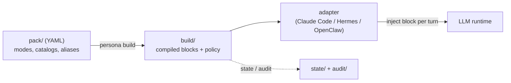

# persona-engine

[English](README.md) | [日本語](README.ja.md) | [简体中文](README.zh-CN.md) | **ไทย**

> เอกสารฉบับทางการคือฉบับภาษาอังกฤษ (README.md) ฉบับแปลจะอัปเดตตามฉบับภาษาอังกฤษและอาจล่าช้ากว่าเล็กน้อย


persona-engine คือเอนจินที่ขับเคลื่อนด้วยนโยบาย (policy-driven) สำหรับสลับโหมดบุคลิกภาพของ LLM agent อย่างปลอดภัย คุณอธิบายแต่ละโหมดด้วย YAML คอมไพล์ pack เพียงครั้งเดียวด้วย `persona build` แล้วให้ runtime adapter ฉีดบล็อกที่คอมไพล์แล้วเข้าไปในทุกเทิร์น โหมดใดได้รับอนุญาตที่ไหน — และใครมีสิทธิ์สลับ — ถูกกำหนดโดย route policy ที่ประกาศไว้อย่างชัดเจน และทุกการเปลี่ยนโหมดจะถูกบันทึกลง audit log แบบ append-only

## ทำไมต้อง persona-engine?

ลองนึกภาพว่าคุณรันผู้ช่วยตัวเดียวในหลายพื้นที่: เซสชันทำงานส่วนตัว ช่องสาธารณะ แชทกลุ่ม คุณอยากให้มันโฟกัสและกระชับตอนทำงาน ผ่อนคลายตอนคุยเล่น และเป็นกลางอย่างเคร่งครัดในทุกที่สาธารณะ วิธีที่ตรงไปตรงมาที่สุด — สลับสตริง system prompt ในโค้ดแอปพลิเคชัน — ใช้ได้ดีจนกระทั่งวันที่มันพัง:

- Prompt แบบ "สบาย ๆ" ที่ตั้งใจใช้เฉพาะเซสชันส่วนตัว รั่วไปที่ช่องสาธารณะ เพราะโค้ดบางเส้นทางลืมตรวจสอบบริบท
- ไม่มีใครตอบได้ว่า "บทสนทนาเมื่อวันอังคารที่แล้ว persona ไหนกำลังทำงานอยู่" เพราะไม่มีอะไรถูกบันทึกไว้เลย
- Prompt โตขึ้นเรื่อย ๆ อย่างไร้ขีดจำกัด และ persona ค่อย ๆ เพี้ยนไปกลางเซสชันทุกครั้งที่มีคนแก้สตริงตรงนั้นเลย

persona-engine เปลี่ยนการจัดการ persona จาก "สตริงที่กระจัดกระจาย" ให้เป็น "ผลลัพธ์ที่คอมไพล์แล้วและผ่านการตรวจนโยบาย":

| | สลับ prompt ด้วยมือ | persona-engine |
| --- | --- | --- |
| ข้อความ persona อยู่ที่ไหน | สตริงกระจายอยู่ทั่วโค้ดแอป | YAML pack ที่อยู่ใน version control คอมไพล์ครั้งเดียว |
| ใครสลับได้ | โค้ดเส้นทางใดก็ได้ที่แก้ prompt ได้ | route policy: allow-list และระดับการสลับตามแต่ละพื้นที่ |
| บริบทที่ไม่รู้จัก / ไม่ match | อะไรก็ตามที่บังเอิญทำงานอยู่ | fail-closed: โหมด `public` ว่างเปล่า สลับไม่ได้ |
| ขนาด prompt | ไร้ขีดจำกัด โตขึ้นเงียบ ๆ | token budget ต่อโหมด — เกินคือ build error ไม่ใช่การตัดทิ้ง |
| ตรวจสอบย้อนหลัง | ไม่มี | audit log แบบ append-only บันทึกทุกการเปลี่ยนและทุกคำตัดสินของนโยบาย |
| ความเสถียร | ถูกแก้ได้ทุกเมื่อ | บล็อกที่คอมไพล์แล้วคงเดิมทุกไบต์ตราบที่โหมดนั้นทำงานอยู่ |

เอนจินไม่เรียก LLM และไม่ตีความข้อความ persona ของคุณ มันจัดการโครงสร้าง การอ้างอิง งบประมาณ ลำดับ และนโยบาย — เนื้อหายังคงเป็นของคุณและถูกมองว่าทึบ (opaque) เสมอ

## หลักการทำงาน



Adapter จะสกัด route context จาก metadata ของ runtime ที่เชื่อถือได้ (แพลตฟอร์ม, session key) ขอให้ core แก้บล็อกสำหรับบริบทนั้น แล้วฉีดบล็อกเข้าที่จุดขยายระดับ request ของ runtime เส้นทาง runtime อ่านเฉพาะผลลัพธ์ที่คอมไพล์แล้วเท่านั้น — ไม่อ่าน YAML เด็ดขาด

| องค์ประกอบ | บทบาท |
| --- | --- |
| [packages/core](packages/core/) | เอนจิน TypeScript: pack compiler, route policy, state store, สัญญา turn/set, CLI `persona` |
| [adapters/claude-code](adapters/claude-code/) | Python hook ที่ฉีดบล็อกปัจจุบันเข้าเซสชัน Claude Code |
| [adapters/hermes](adapters/hermes/) | Adapter สำหรับ agent runtime ตระกูล Hermes |
| [adapters/openclaw](adapters/openclaw/) | Adapter สำหรับ agent runtime ตระกูล OpenClaw |
| [templates/pack-starter](templates/pack-starter/) | pack ตัวอย่าง 4 โหมดที่สมบูรณ์ พร้อมคัดลอกไปแก้ไข |
| [SPEC.md](SPEC.md) | สัญญารูปแบบและนโยบายที่ freeze แล้ว ซึ่งทุก implementation ต้องปฏิบัติตาม |

หลักการออกแบบ 3 ข้อที่ยึดถือตลอดทั้งระบบ:

- **คอมไพล์ ไม่ใช่ตีความ** — runtime อ่าน build artifact ที่ deterministic และบล็อกคงเดิมทุกไบต์ตราบที่โหมดนั้นทำงานอยู่
- **Fail-closed** — บริบทที่ไม่ match route ใดเลยจะได้โหมด `public` ว่างเปล่าและสลับไม่ได้ ข้อผิดพลาดลดระดับเป็น "ไม่ฉีดอะไรเลย" ไม่มีวันกลายเป็น "persona ที่ผิด"
- **Payload ทึบ** — เอนจินจัดการโครงสร้าง การอ้างอิง งบประมาณ และลำดับ ไม่ parse หรือเขียนข้อความ persona ของคุณใหม่

## สารบัญ

- [คุณสมบัติ](#คุณสมบัติ)
- [เริ่มต้นอย่างรวดเร็ว](#เริ่มต้นอย่างรวดเร็ว)
- [ตัวอย่างฉบับสมบูรณ์](#ตัวอย่างฉบับสมบูรณ์)
- [กรณีการใช้งาน](#กรณีการใช้งาน)
- [โมเดลการสลับโหมด](#โมเดลการสลับโหมด)
- [Route policy](#route-policy)
- [CLI](#cli)
- [Adapter](#adapter)
- [โมเดลความปลอดภัย](#โมเดลความปลอดภัย)
- [FAQ](#faq)
- [เอกสาร](#เอกสาร)
- [การพัฒนา](#การพัฒนา)
- [แผนงาน](#แผนงาน)

## คุณสมบัติ

- **pack แบบประกาศ (declarative)** — แต่ละโหมดคือซอง YAML ขนาดเล็ก: sections ที่เรียงลำดับ, token budget และ voice hint แบบเลือกได้, ไฟล์ catalog สำหรับคลังคำศัพท์และตัวอย่างที่นำกลับมาใช้ได้
- **คอมไพล์ครั้งเดียวจบ** — `persona build` แก้ placeholder, บังคับใช้งบประมาณ, และสร้าง artifact แบบ deterministic พร้อมแฮช การอ้างอิงที่เสียและ placeholder ที่แก้ไม่ได้จะหยุด build ทันที
- **Route policy** — allow-list ต่อพื้นที่กำหนดว่าโหมดไหนปรากฏที่ไหนได้ เปิดเส้นทางการสลับแบบใด และแชร์ state domain ไหน
- **สามเส้นทางการสลับ ประตูนโยบายเดียว** — alias จากผู้ใช้, เครื่องมือที่ agent เรียกเอง, และ CLI ของแอดมิน ทั้งหมดผ่านการประเมินนโยบายชุดเดียวกันของ core
- **Audit ในตัว** — ทุกการเปลี่ยนโหมดและทุกการปฏิเสธของนโยบายคืออีเวนต์ใน log JSONL แบบ append-only ตรวจสอบได้ด้วย `persona audit`
- **ไม่ผูกกับ runtime ใด** — core ไม่คุยกับ model API เลย ปัจจุบันมี adapter สำหรับ 3 runtime และสัญญา adapter ใน [SPEC.md](SPEC.md) มีขนาดเล็ก

## เริ่มต้นอย่างรวดเร็ว

ต้องใช้ Node.js 22 ขึ้นไป

```sh
npm install -g @persona-engine/core

persona init ./my-persona
cd my-persona
persona build
persona list
```

`persona init` สร้างการติดตั้งขั้นต่ำ: pack ที่มีโหมด `default` หนึ่งโหมด, `install.yml` ที่มี route แบบระมัดระวังหนึ่งเส้น, และไดเรกทอรี `state/` กับ `audit/` ว่าง ๆ หลังรัน `persona build` แล้ว `persona list` จะแสดงสิ่งที่ runtime มองเห็น:

```text
Modes:
  default: bytes=117 tokens=39 voice_hint=no data_error=false

Routes:
  cli-admin: allowed_modes=[public, default] switching=deny owner_verified=no data_error=false

Note: public is implicitly allowed on every route, whether or not allowed_modes lists it.
```

แก้ `pack/modes/default.yml` แล้วรัน `persona build` อีกครั้ง เท่านี้คุณก็มีการติดตั้งแบบโหมดเดียวที่ใช้งานได้จริง หัวข้อถัดไปจะขยายมันให้เป็นของจริง

## ตัวอย่างฉบับสมบูรณ์

Repository นี้มี pack 4 โหมดฉบับสมบูรณ์ใน [templates/pack-starter/](templates/pack-starter/) — `focus`, `casual`, `professional` และ `roleplay-template` ที่เป็นโครงเปล่า เราจะเดินตั้งแต่ต้นจนจบ: กำหนดโหมด ประกาศนโยบาย build แก้เทิร์น สลับโหมด และตรวจ audit

```sh
git clone https://github.com/caty-ai/persona-engine.git
cp -R persona-engine/templates/pack-starter ./starter-demo
cd starter-demo
mv install.example.yml install.yml
```

**1. โหมดคือซอง YAML ขนาดเล็ก** นี่คือ `modes/focus.yml` ทั้งไฟล์:

```yaml
budget_tokens: 180
voice_hint: concise
sections:
  - id: working-style
    text: |
      Work only on the requested task. Lead with the result, keep the response brief,
      and use short, concrete next steps when they help.
  - id: execution
    text: |
      Make reasonable low-risk assumptions. State blockers plainly instead of adding
      unrelated context or optional discussion.
```

sections มีลำดับและถูกมองว่าทึบ — คอมไพเลอร์ไม่ตีความข้อความ เนื้อหาขนาดใหญ่ (คลังคำศัพท์ ตัวอย่างบทสนทนา) อยู่ในไฟล์ `catalogs/*.txt` ที่โหมดอ้างถึง โหมด `casual` ใน starter แสดงวิธีเชื่อมต่อ

**2. Route และ placeholder อยู่ใน `install.yml`** ไม่ใช่ใน pack — pack บอกว่า "โหมดมีอะไร" ส่วน install บอกว่า "อนุญาตให้ปรากฏที่ไหน":

```yaml
schema_version: 2
pack: .
placeholders:
  agent-name: "Sample Agent"
  owner-name: "Pack Owner"
budget_tokens: 400
runtime: hermes
routes:
  - id: local-workspace
    match: { platform: slack, session_key: { prefix: "owner-" } }
    allowed_modes: [public, focus, casual, professional, roleplay-template]
    switching: explicit-and-agent
    owner_verified: true
    state_domain: workspace
default_route:
  state_domain: quarantine
audit:
  dir: audit/
```

เฉพาะเซสชัน Slack ที่ key ขึ้นต้นด้วย `owner-` เท่านั้นที่ match route แบบเปิดกว้างนี้ ที่เหลือทั้งหมดตกไปที่ default แบบ fail-closed

**3. Build และตรวจสอบ**

```sh
persona build
persona doctor
```

Build จะคอมไพล์แต่ละโหมดเป็นบล็อกพร้อมแฮชและรายงานขนาด (`focus: bytes=320 tokens=107` ฯลฯ) จากนั้น `persona doctor` ตรวจสอบการติดตั้งและชี้จุดอ่อนด้านปฏิบัติการก่อนที่มันจะสร้างปัญหา

**4. แก้เทิร์นหนึ่งเทิร์น** ปกติ adapter ทำให้อัตโนมัติทุกข้อความ แต่นี่คือการรันด้วยมือ บริบทที่ match จะได้บล็อกของโหมดที่ทำงานอยู่:

```sh
echo '{"ctx":{"platform":"slack","session_key":"owner-main"},"actor":"owner","utterance":"hello"}' \
  | persona turn --stdin-json
```

```json
{
  "mode": "focus",
  "block": "<persona-mode id=\"focus\" pack=\"starter-pack@0.1.0\">\nWork only on the requested task. ...",
  "route_id": "local-workspace",
  "state_domain": "workspace",
  "transitioned": false
}
```

บริบทที่ไม่ match route ใดเลยจะได้โหมด `public` ว่างเปล่า — ความพยายามสลับโหมดถูกเพิกเฉยและบันทึกไว้:

```sh
echo '{"ctx":{"platform":"slack","session_key":"public-channel-123"},"actor":"unknown","utterance":"switch to focus"}' \
  | persona turn --stdin-json
```

```json
{
  "mode": "public",
  "block": "",
  "route_id": "__default__",
  "state_domain": "quarantine",
  "transitioned": false,
  "audit": [{ "event": "route_unresolved", "route_id": "__default__", "domain": "quarantine" }]
}
```

**5. สลับโหมด** บน route ที่เชื่อถือได้ alias แบบ match ทั้งประโยค (ประกาศใน `aliases.yml`) จะสลับโหมดเป็นส่วนหนึ่งของเทิร์น:

```sh
echo '{"ctx":{"platform":"slack","session_key":"owner-main"},"actor":"owner","utterance":"switch to casual"}' \
  | persona turn --stdin-json
```

ผลลัพธ์มีบล็อก `casual` ใหม่พร้อมอีเวนต์ audit `mode_transition` (`from: focus, to: casual, set_by: owner`) ส่วนแอดมินสลับได้จาก CLI โดยไม่ต้องผ่านเทิร์น:

```sh
persona set professional --domain workspace
persona get --domain workspace
persona audit
```

```text
Audit events (newest first):
  2026-07-16T17:31:35Z mode_transition route=local-workspace domain=workspace from=focus to=casual set_by=owner
  2026-07-16T17:30:43Z mode_transition route=__admin__ domain=workspace from=public to=focus set_by=admin
```

**6. เชื่อมต่อ adapter** ถ้าอยากรันในตัว agent จริงแทนการรันด้วยมือ ให้ชี้ adapter ไปที่การติดตั้งนี้ สำหรับ Claude Code คือ hook ระดับโปรเจกต์ — snippet `settings.json` ฉบับเต็มอยู่ใน [README ของ adapter Claude Code](adapters/claude-code/README.md) ส่วน [Hermes](adapters/hermes/README.md) และ [OpenClaw](adapters/openclaw/README.md) ใช้รูปแบบเดียวกันบน runtime ของตน

## กรณีการใช้งาน

- **ผู้ช่วยหนึ่งตัว หลายพื้นที่** — โฟกัสและกระชับในเซสชันทำงานส่วนตัว ผ่อนคลายตอนคุยเล่น เป็นกลางอย่างเคร่งครัด (`public`) ในทุกพื้นที่ที่ไม่รู้จัก — บังคับใช้ด้วย route policy ไม่ใช่ด้วยข้อตกลงปากเปล่า
- **ชุดโทนสำเร็จรูปตามงาน** — เก็บ variant `focus` / `casual` / `professional` ของผู้ช่วยตัวเดียวกัน แล้วสลับตามงานด้วยประโยคเดียว โดยไม่ต้อง deploy ใหม่หรือแก้ config
- **โหมด roleplay / ตัวละครที่ปลอดภัย** — จำกัดเนื้อหา persona ที่เข้มข้นไว้บน route ที่มี `owner_verified: true` และการสลับแบบ explicit เท่านั้น พื้นที่ที่ไม่ match route นั้นจะไม่มีวันเห็นหรือเปิดใช้งานมันได้
- **การแก้ persona ที่ตรวจทานได้** — pack คือไฟล์: การแก้ persona มาในรูป diff ใน version control งบประมาณถูกบังคับใช้ตอน build และ audit log ตอบได้ว่า "อะไรทำงานอยู่ ที่ไหน เมื่อไหร่ และใครสลับ"

## โมเดลการสลับโหมด

มีเส้นทางการสลับ 3 แบบ ทุกการเปลี่ยนโหมดถูกบันทึกลง audit log

1. **Explicit** — การ match alias ทั้งประโยค (เช่น "switch to focus") ทำงานเฉพาะบน route ที่ระดับ `switching` เป็น explicit ขึ้นไป
2. **Agent-initiated** — เครื่องมือ `persona_set` ถูกลงทะเบียนเฉพาะบน route ที่มี `switching: explicit-and-agent` และ `owner_verified: true`
3. **Admin** — `persona set <mode> --domain <domain>` จาก CLI

การเพิ่มโหมดทำได้โดยวางไฟล์ `pack/modes/*.yml` ใหม่แล้วรัน `persona build` อีกครั้ง placeholder อย่าง `{{agent-name}}` / `{{owner-name}}` ถูกแก้จากการประกาศใน `install.yml` — placeholder ที่แก้ไม่ได้จะหยุด build ด้วย `E_PLACEHOLDER_UNRESOLVED`

## Route policy

Route คือขอบเขตความปลอดภัย แต่ละ route จะ match กับ metadata ของ runtime ที่เชื่อถือได้ และประกาศว่าที่นั่นอนุญาตอะไรบ้าง:

- `match` — เงื่อนไขบนบริบทที่ adapter ส่งมา (แพลตฟอร์ม, prefix ของ session key, ฯลฯ) การ match ใช้เฉพาะ metadata ที่เชื่อถือได้ ไม่ใช้เนื้อหาข้อความเด็ดขาด
- `allowed_modes` — โหมดที่พื้นที่นี้แสดงได้ `public` ถูกอนุญาตโดยปริยายทุกที่
- `switching` — `deny` / `explicit` / `explicit-and-agent`: เส้นทางการสลับแบบใดเปิดใช้ที่นี่
- `owner_verified` — จำเป็นสำหรับการสลับโดย agent ประกาศเฉพาะบนพื้นที่ที่ runtime ยืนยันตัวตนเจ้าของได้จริงเท่านั้น
- `state_domain` — พื้นที่ที่แชร์ domain เดียวกันจะแชร์โหมดที่ทำงานอยู่ ต่าง domain แยกขาดจากกัน

บริบทที่ไม่ match route ใดเลยใช้ `default_route` — `public` แบบ fail-closed พร้อม state domain กักกันของตัวเอง จง config route ก่อนเปิดการสลับ และให้พื้นที่แชร์ / กลุ่มยังคงระมัดระวังไว้ก่อน ดูสัญญาฉบับเต็มที่ [SPEC.md](SPEC.md) §6

## CLI

| คำสั่ง | หน้าที่ |
| --- | --- |
| `persona init <dir>` | สร้างโครงการติดตั้งใหม่ (แบบโต้ตอบ หรือ `--yes` เพื่อใช้ค่าเริ่มต้น) |
| `persona build` | คอมไพล์ pack เป็น artifact แบบ deterministic สำหรับ runtime |
| `persona doctor` | ตรวจสอบการติดตั้งและรายงาน issues / warnings / notes |
| `persona list` | แสดงโหมดและ route ที่คอมไพล์แล้วในมุมมองของ runtime |
| `persona get --domain <d>` | แสดงโหมดที่ทำงานอยู่และ revision ของ state domain |
| `persona set <mode> --domain <d>` | สลับโหมดโดยแอดมิน |
| `persona turn --stdin-json` | แก้หนึ่งเทิร์นจากบริบท JSON (สิ่งที่ adapter เรียกใช้) |
| `persona audit` | พิมพ์อีเวนต์ audit เรียงจากใหม่ไปเก่า |

คำสั่งส่วนใหญ่รับ `--dir <install>` เพื่อชี้ไปยังการติดตั้งนอกไดเรกทอรีปัจจุบัน ดูสัญญารูปแบบและนโยบายฉบับสมบูรณ์ที่ [SPEC.md](SPEC.md)

## Adapter

| Adapter | Runtime | จุดฉีด |
| --- | --- | --- |
| [Claude Code](adapters/claude-code/README.md) | Claude Code | hook `UserPromptSubmit` / `SessionStart` |
| [Hermes](adapters/hermes/README.md) | agent ตระกูล Hermes | ฉีดบริบทต่อเทิร์น |
| [OpenClaw](adapters/openclaw/README.md) | agent ตระกูล OpenClaw | ฉีดบริบทต่อเทิร์น |

Adapter ถูกออกแบบให้บางโดยตั้งใจ: สกัด route context จาก metadata ที่เชื่อถือได้ เรียก core ฉีดบล็อกที่ได้กลับมา และ fail safe (ไม่ฉีดอะไรเลย) เมื่อเกิดข้อผิดพลาด หากต้องการรองรับ runtime อื่น ให้ implement สัญญา adapter ใน [SPEC.md](SPEC.md) §10

## โมเดลความปลอดภัย

- **pack คือทรัพย์สินของผู้ดูแลระบบที่เชื่อถือได้** — เอนจินป้องกัน "เนื้อหา persona ปรากฏบนพื้นที่ที่ผิด" ไม่ได้ sandbox ผู้เขียน pack ที่มุ่งร้าย จงรีวิว pack เหมือนรีวิวโค้ด
- **Fail-closed โดยโครงสร้าง** — route ที่ไม่รู้จักได้โหมด `public` ว่างเปล่าและสลับไม่ได้ ข้อผิดพลาดของ adapter ลดระดับเป็น "ไม่ฉีด" — ไม่มีวันเป็น persona ที่ค้างเก่าหรือผิด
- **บนดิสก์เป็น plaintext** — บล็อกที่คอมไพล์แล้วและค่า placeholder อยู่ใน `build/` แบบ plaintext ห้ามใส่ credential หรือความลับใด ๆ ใน placeholder หรือเนื้อหา pack
- **State อยู่เฉพาะเครื่อง** — state ของโหมดที่ทำงานอยู่อยู่บนโฮสต์ที่ฉีด และไม่ sync ระหว่างเครื่อง
- **ทุกคำตัดสินสังเกตได้** — การเปลี่ยนโหมด การปฏิเสธ และ route ที่แก้ไม่ได้ ล้วนเป็นอีเวนต์ audit แบบ append-only

ดู threat model และวิธีรายงานช่องโหว่ที่ [SECURITY.md](SECURITY.md)

## FAQ

**persona-engine เรียก LLM หรือต้องใช้ API key ไหม?**
ไม่ มันแค่คอมไพล์และเสิร์ฟบล็อก persona — runtime ของคุณเป็นฝ่ายคุยกับโมเดล เอนจินไม่ผูกกับผู้ให้บริการรายใดโดยโครงสร้าง

**บริบทที่ไม่เคยตั้งค่าไว้จะเกิดอะไรขึ้น?**
มันไม่ match route ใด จึงได้โหมด `public` ว่างเปล่าและสลับไม่ได้ fail-closed คือค่าเริ่มต้น ไม่ใช่ตัวเลือกที่ต้องเปิดเอง

**Agent ตัดสินใจสลับ persona เองได้ไหม?**
ได้เฉพาะบน route ที่ประกาศ `switching: explicit-and-agent` **และ** `owner_verified: true` และเฉพาะในขอบเขต `allowed_modes` ของ route นั้น ที่อื่นเครื่องมือ `persona_set` จะไม่ถูกลงทะเบียนด้วยซ้ำ

**State เก็บที่ไหน? sync ระหว่างเครื่องไหม?**
เก็บใน `state/<domain>.json` ภายในการติดตั้ง บนโฮสต์ที่ฉีด ไม่มีการ sync ใด ๆ — แต่ละโฮสต์แก้ของตัวเองอย่างอิสระ

**ใส่ความลับใน pack หรือ placeholder ได้ไหม?**
ไม่ได้ ผลลัพธ์ที่คอมไพล์แล้วเป็น plaintext บนดิสก์ จงปฏิบัติกับเนื้อหา pack เหมือนไฟล์ซอร์สโค้ดที่จะถูก commit

**เพิ่มหรือแก้โหมดยังไง?**
เพิ่มหรือแก้ `pack/modes/<id>.yml` แล้วรัน `persona build` อีกครั้ง งบประมาณ การอ้างอิง และ placeholder ถูกตรวจตอน build — runtime เห็นแต่ผลลัพธ์ที่คอมไพล์แล้วเสมอ

**ควบคุมต้นทุน token ยังไง?**
แต่ละโหมดมีงบประมาณที่มีผลจริง — ค่าที่น้อยกว่าระหว่างงบของ install กับ `budget_tokens` ของโหมดเอง เกินคือ build error ไม่ใช่การตัดทิ้ง persona ที่บวมเกินจึงถูกจับได้ก่อนถึง runtime

**รองรับ runtime ไหนบ้าง?**
ปัจจุบันคือ Claude Code, Hermes และ OpenClaw สัญญา adapter ([SPEC.md](SPEC.md) §10) มีขนาดเล็ก — สกัดบริบท เรียก core และฉีดหนึ่งบล็อก

## เอกสาร

| เอกสาร | เนื้อหา |
| --- | --- |
| [SPEC.md](SPEC.md) | สัญญารูปแบบและนโยบายที่ freeze แล้ว: pack schema, route policy, turn/set, กฎ fail-closed |
| [docs/INSTALL.md](docs/INSTALL.md) | คู่มือการติดตั้ง |
| [templates/pack-starter/README.md](templates/pack-starter/README.md) | ผ่า starter pack: ซองโหมด, catalog, งบประมาณ, route |
| [adapters/*/README.md](adapters/) | การติดตั้งและตั้งค่าตามแต่ละ runtime |
| [SECURITY.md](SECURITY.md) | Threat model และการรายงานช่องโหว่ |
| [CONTRIBUTING.md](CONTRIBUTING.md) | คู่มือการมีส่วนร่วม |

## การพัฒนา

```sh
git clone https://github.com/caty-ai/persona-engine.git
cd persona-engine
npm install
npm test
npm run typecheck
python3 -m pytest adapters
```

สำหรับ source checkout ตัว CLI อยู่ที่ `packages/core/bin/persona` (ตั้ง alias หรือกำหนด `PERSONA_BIN` ให้ adapter) fixture ที่แชร์กันใต้ `spec/fixtures/` ใช้ตรวจ TypeScript core และ Python adapter กับสัญญา runtime ชุดเดียวกัน

## แผนงาน

- [x] M0 — runtime spike + freeze SPEC
- [x] M1 — core (compiler / policy / state / turn / CLI)
- [x] M2 — adapter Hermes + doctor + deploy agent production ตัวแรก
- [x] M3 — adapter OpenClaw + CLI สังเกตการณ์ (get / list / audit) + voice coloring + การสลับโดย agent
- [x] M4 — เปิดตัวสาธารณะ: npm packaging + init wizard + template starter pack + adapter Claude Code + เกตด้านไลเซนส์และความปลอดภัย

v0.1.0 คือรุ่นสาธารณะรุ่นแรก ยินดีรับ issue และข้อเสนอ — ดู[การมีส่วนร่วม](#การมีส่วนร่วม)

## การมีส่วนร่วม

ดู [CONTRIBUTING.md](CONTRIBUTING.md) โปรดรายงานช่องโหว่ด้านความปลอดภัยแบบส่วนตัวตามที่อธิบายไว้ใน [SECURITY.md](SECURITY.md)

## ไลเซนส์

MIT © Caty ดู [LICENSE](LICENSE)
