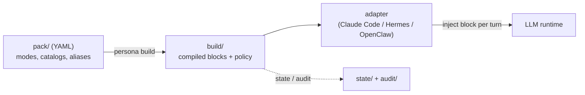

# persona-engine

[English](README.md) | [日本語](README.ja.md) | **简体中文** | [ไทย](README.th.md)

> 本文档的权威版本为英文版（README.md）。翻译版本跟随英文版更新，内容可能略有滞后。


persona-engine 是一个安全的、策略驱动的引擎，用于切换 LLM 智能体的人格模式。你用 YAML 描述每个模式，通过 `persona build` 一次性编译整个 pack，然后由运行时适配器在每一轮对话中注入对应的编译产物块。哪个模式允许出现在哪里——以及谁可以切换——由显式的路由策略决定，且每次切换都会记录到只追加的审计日志中。

## 为什么选择 persona-engine？

设想你在多个场景中运行同一个助手：私人工作会话、公开频道、群聊。你希望它在工作时专注简洁，在闲聊时轻松随和，而在任何公开场合保持严格中立。最直接的做法——在应用代码里替换 system prompt 字符串——在出问题之前似乎都没问题：

- 某个忘记检查上下文的代码路径，把本该只用于私人会话的"随和"提示词泄漏到了公开频道。
- 没人能回答"上周二那段对话里当时激活的是哪个人格"——因为什么都没有记录。
- 提示词无限膨胀，而且只要有人就地改一个字符串，人格就会在会话中悄悄漂移。

persona-engine 把人格管理从"散落各处的字符串"变成"编译过的、经过策略检查的产物"：

| | 手写提示词切换 | persona-engine |
| --- | --- | --- |
| 人格文本的位置 | 散落在应用代码中的字符串 | 版本管理的 YAML pack，一次编译 |
| 谁可以切换 | 任何能改提示词的代码路径 | 路由策略：按场景的允许列表和切换级别 |
| 未知 / 未匹配的上下文 | 恰好处于激活状态的那个 | fail-closed：空的 `public` 模式，禁止切换 |
| 提示词大小 | 无限制、悄悄膨胀 | 每个模式有 token 预算——超出是构建错误而非截断 |
| 可追溯性 | 无 | 只追加的审计日志记录每次切换和策略决定 |
| 稳定性 | 随时可能被改动 | 模式激活期间，编译块保持逐字节不变 |

引擎从不调用 LLM，也从不解释你的人格文本。它管理的是结构、引用、预算、顺序和策略——内容始终属于你，并保持不透明。

## 工作原理



适配器从可信的运行时元数据（平台、会话键）推导路由上下文，请求核心为该上下文解析一个块，并把该块注入到运行时的请求级扩展点。运行时路径只读取编译产物——从不读取 YAML。

| 组件 | 职责 |
| --- | --- |
| [packages/core](packages/core/) | TypeScript 引擎：pack 编译器、路由策略、状态存储、turn/set 契约、`persona` CLI |
| [adapters/claude-code](adapters/claude-code/) | 向 Claude Code 会话注入当前块的 Python 钩子 |
| [adapters/hermes](adapters/hermes/) | 面向 Hermes 系智能体运行时的适配器 |
| [adapters/openclaw](adapters/openclaw/) | 面向 OpenClaw 系智能体运行时的适配器 |
| [templates/pack-starter](templates/pack-starter/) | 可直接复制修改的完整四模式示例 pack |
| [SPEC.md](SPEC.md) | 所有实现共同遵循的冻结格式与策略契约 |

贯穿始终的三条设计原则：

- **编译，而非解释。** 运行时读取确定性的构建产物；模式激活期间块保持逐字节不变。
- **Fail-closed。** 未匹配任何路由的上下文解析为空的 `public` 模式且无法切换。出错时降级为"不注入"，绝不落到"错误的人格"。
- **载荷不透明。** 引擎管理结构、引用、预算和顺序，从不解析或改写你的人格文本。

## 目录

- [特性](#特性)
- [快速开始](#快速开始)
- [完整示例](#完整示例)
- [使用场景](#使用场景)
- [切换模型](#切换模型)
- [路由策略](#路由策略)
- [CLI 参考](#cli-参考)
- [适配器](#适配器)
- [安全模型](#安全模型)
- [FAQ](#faq)
- [文档](#文档)
- [开发](#开发)
- [路线图](#路线图)

## 特性

- **声明式 pack** — 每个模式是一个小的 YAML 信封：有序的 sections、可选的 token 预算与 voice hint，以及可复用的词汇 / 示例 catalog 文件。
- **一次性编译** — `persona build` 解析占位符、强制执行预算，并生成带哈希的确定性产物。损坏的引用和未解析的占位符会中止构建。
- **路由策略** — 按场景的允许列表决定哪些模式可以出现在哪里、启用哪些切换路径、共享哪个状态域。
- **三条切换路径，一个策略闸门** — 用户的显式别名、智能体发起的工具调用、管理员 CLI，全部经过同一套核心策略评估。
- **内建审计** — 每次切换和每次策略拒绝都是只追加 JSONL 日志中的事件，可用 `persona audit` 查看。
- **运行时无关** — 核心从不与模型 API 通信。目前有三个运行时的适配器，且 [SPEC.md](SPEC.md) 中的适配器契约很小。

## 快速开始

需要 Node.js 22 或更高版本。

```sh
npm install -g @persona-engine/core

persona init ./my-persona
cd my-persona
persona build
persona list
```

`persona init` 会生成一个最小安装：包含一个 `default` 模式的 pack、带一条保守路由的 `install.yml`，以及空的 `state/` 和 `audit/` 目录。运行 `persona build` 之后，`persona list` 展示运行时将看到的内容：

```text
Modes:
  default: bytes=117 tokens=39 voice_hint=no data_error=false

Routes:
  cli-admin: allowed_modes=[public, default] switching=deny owner_verified=no data_error=false

Note: public is implicitly allowed on every route, whether or not allowed_modes lists it.
```

编辑 `pack/modes/default.yml`，重新运行 `persona build`，你就有了一个可用的单模式安装。下一节把它扩展成真实可用的配置。

## 完整示例

仓库在 [templates/pack-starter/](templates/pack-starter/) 中附带了一个完整的四模式 pack——`focus`、`casual`、`professional`，以及仅有骨架的 `roleplay-template`。我们端到端走一遍：定义模式、声明策略、构建、解析轮次、切换、审计。

```sh
git clone https://github.com/caty-ai/persona-engine.git
cp -R persona-engine/templates/pack-starter ./starter-demo
cd starter-demo
mv install.example.yml install.yml
```

**1. 模式是一个小的 YAML 信封。** 这是 `modes/focus.yml` 的全文：

```yaml
budget_tokens: 180
voice_hint: concise
sections:
  - id: working-style
    text: |
      Work only on the requested task. Lead with the result, keep the response brief,
      and use short, concrete next steps when they help.
  - id: execution
    text: |
      Make reasonable low-risk assumptions. State blockers plainly instead of adding
      unrelated context or optional discussion.
```

sections 是有序且不透明的——编译器从不解释其中的文本。较大的素材（词汇表、示例对话）放在模式引用的 `catalogs/*.txt` 文件中；starter 中的 `casual` 模式展示了接线方式。

**2. 路由和占位符放在 `install.yml`，** 而不是 pack 里。pack 描述"模式包含什么"，install 描述"允许出现在哪里"：

```yaml
schema_version: 2
pack: .
placeholders:
  agent-name: "Sample Agent"
  owner-name: "Pack Owner"
budget_tokens: 400
runtime: hermes
routes:
  - id: local-workspace
    match: { platform: slack, session_key: { prefix: "owner-" } }
    allowed_modes: [public, focus, casual, professional, roleplay-template]
    switching: explicit-and-agent
    owner_verified: true
    state_domain: workspace
default_route:
  state_domain: quarantine
audit:
  dir: audit/
```

只有会话键以 `owner-` 开头的 Slack 会话才能匹配这条宽松路由，其余一切都落入 fail-closed 的默认路由。

**3. 构建与检查。**

```sh
persona build
persona doctor
```

构建把每个模式编译成带哈希的块并报告其大小（如 `focus: bytes=320 tokens=107`）。随后 `persona doctor` 验证安装，并在运维隐患造成影响之前提前指出。

**4. 解析一轮对话。** 实际使用中适配器会在每条消息上自动完成；这里我们手动执行。匹配的上下文会得到当前模式的块：

```sh
echo '{"ctx":{"platform":"slack","session_key":"owner-main"},"actor":"owner","utterance":"hello"}' \
  | persona turn --stdin-json
```

```json
{
  "mode": "focus",
  "block": "<persona-mode id=\"focus\" pack=\"starter-pack@0.1.0\">\nWork only on the requested task. ...",
  "route_id": "local-workspace",
  "state_domain": "workspace",
  "transitioned": false
}
```

未匹配任何路由的上下文得到空的 `public` 模式——其切换请求被忽略并记录在案：

```sh
echo '{"ctx":{"platform":"slack","session_key":"public-channel-123"},"actor":"unknown","utterance":"switch to focus"}' \
  | persona turn --stdin-json
```

```json
{
  "mode": "public",
  "block": "",
  "route_id": "__default__",
  "state_domain": "quarantine",
  "transitioned": false,
  "audit": [{ "event": "route_unresolved", "route_id": "__default__", "domain": "quarantine" }]
}
```

**5. 切换模式。** 在受信任的路由上，（在 `aliases.yml` 中声明的）全句别名会在轮次中完成模式切换：

```sh
echo '{"ctx":{"platform":"slack","session_key":"owner-main"},"actor":"owner","utterance":"switch to casual"}' \
  | persona turn --stdin-json
```

结果包含新的 `casual` 块和一条 `mode_transition` 审计事件（`from: focus, to: casual, set_by: owner`）。管理员切换不经过轮次，直接用 CLI：

```sh
persona set professional --domain workspace
persona get --domain workspace
persona audit
```

```text
Audit events (newest first):
  2026-07-16T17:31:35Z mode_transition route=local-workspace domain=workspace from=focus to=casual set_by=owner
  2026-07-16T17:30:43Z mode_transition route=__admin__ domain=workspace from=public to=focus set_by=admin
```

**6. 接入适配器。** 要在真实的智能体内运行而不是手动执行，把适配器指向这个安装即可。对 Claude Code 来说是一个项目级钩子——完整的 `settings.json` 片段见 [Claude Code 适配器 README](adapters/claude-code/README.md)；[Hermes](adapters/hermes/README.md) 和 [OpenClaw](adapters/openclaw/README.md) 在各自的运行时上遵循相同模式。

## 使用场景

- **一个助手，多个场景。** 在私人工作会话中专注简洁，闲聊时轻松随和，在所有未识别的场景中严格中立（`public`）——由路由策略强制执行，而非靠约定。
- **按任务切换语气预设。** 为同一个助手维护 `focus` / `casual` / `professional` 变体，一句话即可按任务切换，无需重新部署或修改配置。
- **安全的角色扮演 / 角色模式。** 把较重的人格内容限制在 `owner_verified: true` 且显式切换的路由上。不匹配该路由的场景既看不到它，也无法激活它。
- **可审查的人格变更。** pack 就是文件：人格变更以版本管理中的 diff 形式出现，预算在构建时强制执行，审计日志可以回答"何时、何地、哪个模式激活、谁切换的"。

## 切换模型

共有三条切换路径；每次切换都记录在审计日志中。

1. **显式（Explicit）** — 全句别名匹配（例如 "switch to focus"）。仅在 `switching` 级别为 explicit 或更高的路由上生效。
2. **智能体发起（Agent-initiated）** — `persona_set` 工具。仅在 `switching: explicit-and-agent` 且 `owner_verified: true` 的路由上注册。
3. **管理员（Admin）** — 通过 CLI 执行 `persona set <mode> --domain <domain>`。

要添加模式，放入新的 `pack/modes/*.yml` 文件并重新运行 `persona build`。`{{agent-name}}` / `{{owner-name}}` 等占位符从 `install.yml` 的声明中解析；未解析的占位符会以 `E_PLACEHOLDER_UNRESOLVED` 中止构建。

## 路由策略

路由是安全边界。每条路由匹配可信的运行时元数据，并声明该处允许的行为：

- `match` — 对适配器提供的上下文的条件（平台、会话键前缀等）。匹配只使用可信元数据，绝不使用消息内容。
- `allowed_modes` — 该场景允许展示的模式。`public` 在任何地方都被隐式允许。
- `switching` — `deny` / `explicit` / `explicit-and-agent`：此处启用哪些切换路径。
- `owner_verified` — 智能体发起切换的必要条件；只在运行时能真正认证所有者的场景上声明。
- `state_domain` — 共享同一域的场景共享激活模式；不同的域相互隔离。

未匹配任何路由的上下文使用 `default_route`——fail-closed 的 `public`，并拥有独立的隔离状态域。请先配置路由再启用切换，并让共享 / 群组场景保持保守。完整契约见 [SPEC.md](SPEC.md) §6。

## CLI 参考

| 命令 | 作用 |
| --- | --- |
| `persona init <dir>` | 生成新安装的脚手架（交互式，或用 `--yes` 取默认值） |
| `persona build` | 把 pack 编译为确定性的运行时产物 |
| `persona doctor` | 验证安装并报告 issues / warnings / notes |
| `persona list` | 展示运行时视角下的已编译模式与路由 |
| `persona get --domain <d>` | 显示某状态域的激活模式与修订号 |
| `persona set <mode> --domain <d>` | 管理员模式切换 |
| `persona turn --stdin-json` | 从 JSON 上下文解析一轮对话（适配器调用的接口） |
| `persona audit` | 按时间倒序打印审计事件 |

大多数命令接受 `--dir <install>` 以指向当前目录之外的安装。完整的格式与策略契约见 [SPEC.md](SPEC.md)。

## 适配器

| 适配器 | 运行时 | 注入点 |
| --- | --- | --- |
| [Claude Code](adapters/claude-code/README.md) | Claude Code | `UserPromptSubmit` / `SessionStart` 钩子 |
| [Hermes](adapters/hermes/README.md) | Hermes 智能体 | 每轮上下文注入 |
| [OpenClaw](adapters/openclaw/README.md) | OpenClaw 智能体 | 每轮上下文注入 |

适配器刻意保持轻薄：从可信运行时元数据推导路由上下文，调用核心，注入返回的块，出错时安全降级（不注入）。要支持其他运行时，请实现 [SPEC.md](SPEC.md) §10 中的适配器契约。

## 安全模型

- **pack 是受信任的运营者资产。** 引擎防范的是"人格内容出现在错误的场景"，而不是沙箱化恶意的 pack 作者。请像审查代码一样审查 pack。
- **结构性 fail-closed。** 未知路由解析为空的 `public` 模式且无法切换。适配器错误降级为"不注入"——绝不会是过期或错误的人格。
- **磁盘上是明文。** 编译块和占位符值以明文形式存放在 `build/` 中。绝不要把凭据或其他机密放进占位符或 pack 内容。
- **状态保留在本地。** 激活模式的状态位于注入主机上，不在机器之间同步。
- **每个决定都可观测。** 切换、拒绝和未解析路由都是只追加的审计事件。

威胁模型与漏洞报告方式见 [SECURITY.md](SECURITY.md)。

## FAQ

**persona-engine 会调用 LLM 吗？需要 API 密钥吗？**
不会。它只编译并提供人格块；与模型通信的是你的运行时。引擎在结构上与提供商无关。

**在从未配置过的上下文中会发生什么？**
它不匹配任何路由，解析为空的 `public` 模式，且无法切换。fail-closed 是默认行为，不是需要开启的选项。

**智能体可以自行决定切换人格吗？**
只有在声明了 `switching: explicit-and-agent` **且** `owner_verified: true` 的路由上，并且只能在该路由的 `allowed_modes` 范围内。在其他任何地方，`persona_set` 工具根本不会被注册。

**状态存储在哪里？会在机器之间同步吗？**
存储在安装目录内的 `state/<domain>.json`，位于注入主机上。不做任何同步；每台主机独立解析。

**可以把机密放进 pack 或占位符吗？**
不可以。编译产物在磁盘上是明文。请把 pack 内容当作任何会被提交的源码文件对待。

**如何添加或修改模式？**
添加或编辑 `pack/modes/<id>.yml`，重新运行 `persona build`。预算、引用和占位符都在构建时验证；运行时只会看到编译结果。

**token 成本如何控制？**
每个模式都有生效预算——取 install 预算与模式自身 `budget_tokens` 中较小者。超出是构建错误而非截断，因此过大的人格在到达运行时之前就会被拦下。

**支持哪些运行时？**
目前是 Claude Code、Hermes 和 OpenClaw。适配器契约（[SPEC.md](SPEC.md) §10）很小——推导上下文、调用核心、注入一个块。

## 文档

| 文档 | 内容 |
| --- | --- |
| [SPEC.md](SPEC.md) | 冻结的格式与策略契约：pack 模式、路由策略、turn/set、fail-closed 规则 |
| [docs/INSTALL.md](docs/INSTALL.md) | 安装指南 |
| [templates/pack-starter/README.md](templates/pack-starter/README.md) | starter pack 解析：信封、catalog、预算、路由 |
| [adapters/*/README.md](adapters/) | 各运行时的安装与配置 |
| [SECURITY.md](SECURITY.md) | 威胁模型与漏洞报告 |
| [CONTRIBUTING.md](CONTRIBUTING.md) | 贡献指南 |

## 开发

```sh
git clone https://github.com/caty-ai/persona-engine.git
cd persona-engine
npm install
npm test
npm run typecheck
python3 -m pytest adapters
```

对源码检出而言，CLI 位于 `packages/core/bin/persona`（可以设置别名，或为适配器设置 `PERSONA_BIN`）。`spec/fixtures/` 下的共享夹具用同一份运行时契约同时验证 TypeScript 核心与 Python 适配器。

## 路线图

- [x] M0 — 运行时 spike + SPEC 冻结
- [x] M1 — 核心（编译器 / 策略 / 状态 / turn / CLI）
- [x] M2 — Hermes 适配器 + doctor + 首个生产智能体部署
- [x] M3 — OpenClaw 适配器 + 可观测 CLI（get / list / audit）+ voice coloring + 智能体发起切换
- [x] M4 — 公开发布：npm 打包 + init 向导 + starter pack 模板 + Claude Code 适配器 + 许可与安全闸门

v0.1.0 是首个公开版本。欢迎提交 Issue 与建议——见[贡献](#贡献)。

## 贡献

见 [CONTRIBUTING.md](CONTRIBUTING.md)。安全漏洞请按 [SECURITY.md](SECURITY.md) 中的说明私下报告。

## 许可证

MIT © Caty. 见 [LICENSE](LICENSE)。
